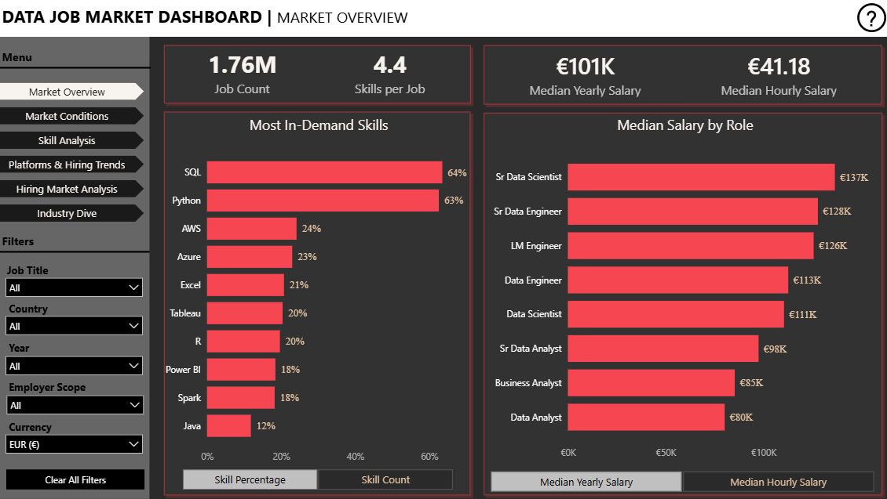
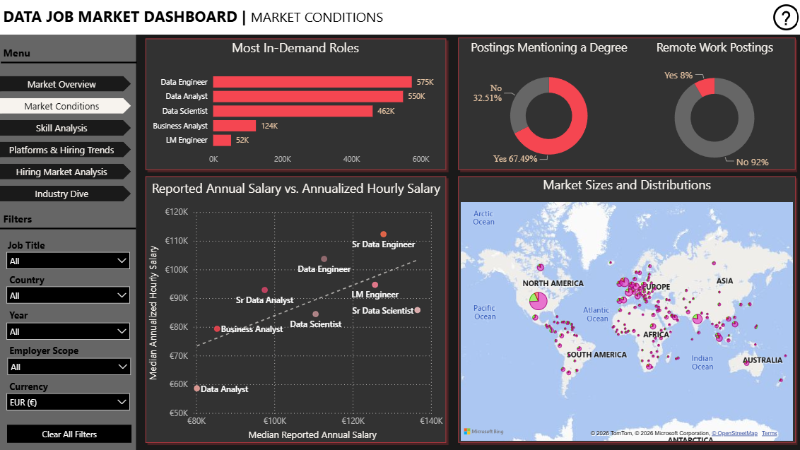
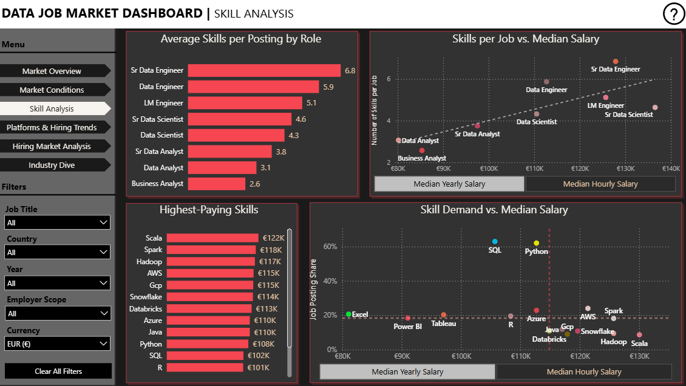
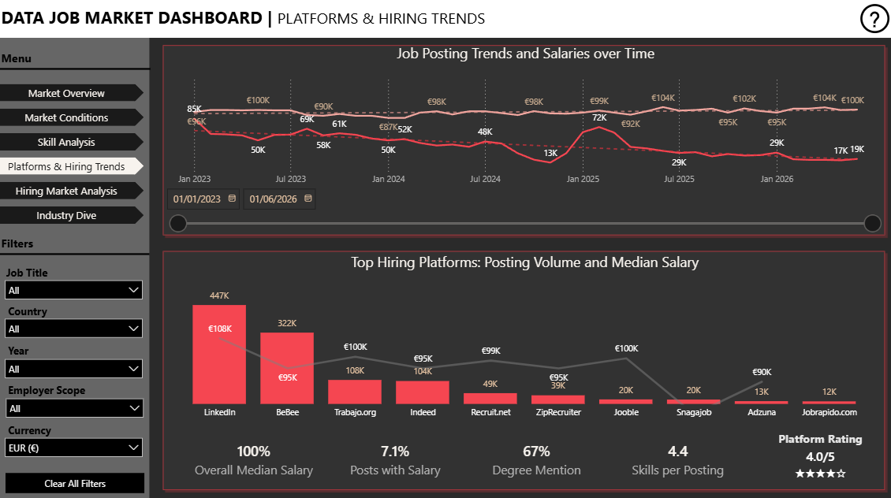
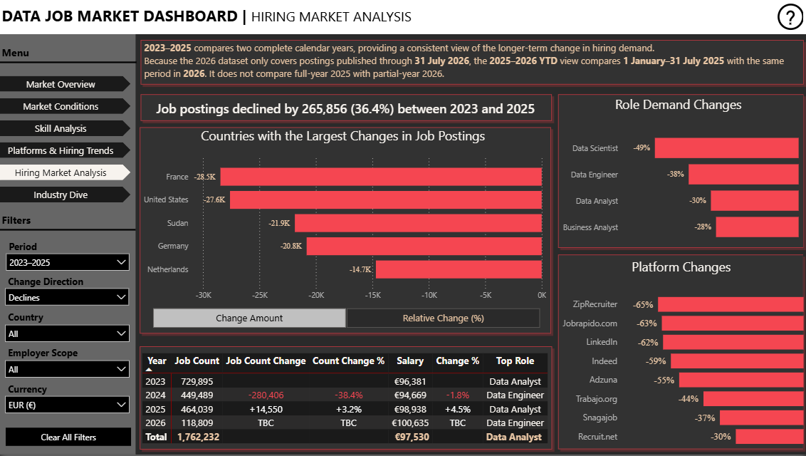
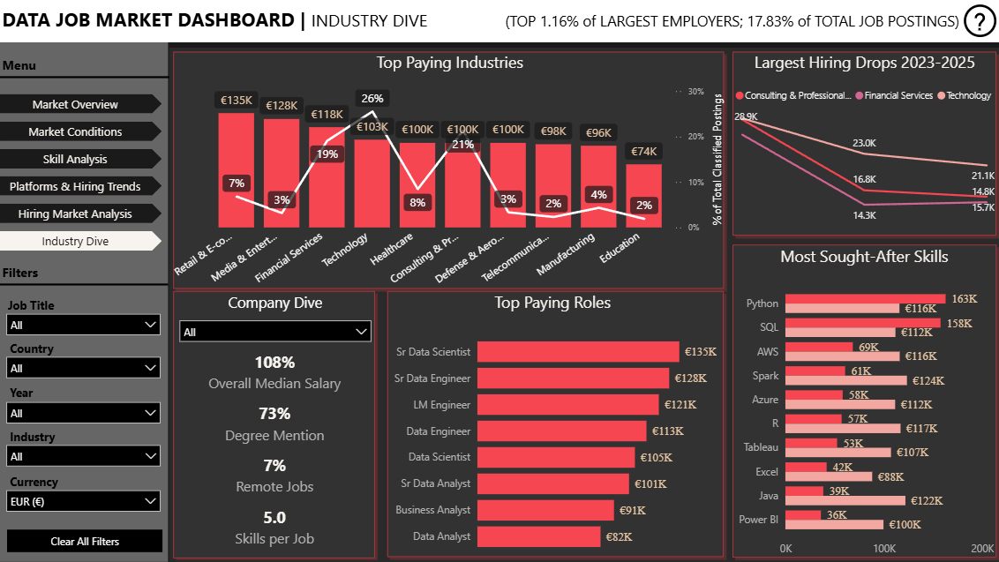

# Data Job Market Dashboard

An interactive Power BI analysis of **1,762,232 data-job postings** published from **January 2023 through 31 July 2026**. The dashboard brings together hiring demand, compensation, skills, platforms, geographic patterns and an employer-industry enrichment pipeline.

> **2026 is incomplete.** Full-period trend visuals include data available through 31 July 2026. The Hiring Market Analysis page keeps long-term and current-period comparisons separate: **full-year 2023 vs. full-year 2025**, and **1 January-31 July 2025 vs. the same dates in 2026**.

## Contents

- [Project objectives](#project-objectives)
- [Dashboard scope](#dashboard-scope)
- [Data and methodology](#data-and-methodology)
- [Dashboard pages and findings](#dashboard-pages-and-findings)
- [Key conclusions](#key-conclusions)
- [Limitations](#limitations)
- [Further research](#further-research)
- [Industry Dive: company-industry enrichment](#industry-dive-company-industry-enrichment)

## Project objectives

This project was built to answer six practical questions:

1. How large is the market for the selected data professions, and how has demand changed since 2023?
2. Which roles, countries and hiring platforms account for the largest movements?
3. Which roles and technical skills are associated with the strongest compensation?
4. How common are degree requirements, remote work and salary disclosure?
5. Which platforms provide the best balance of reach, salary, transparency and accessibility?
6. How do industry-classified employers differ from staffing firms and the rest of the market?

## Dashboard scope

### Occupational scope

The current dashboard uses the following standardized role groups:

- Data Analyst and Senior Data Analyst
- Data Scientist and Senior Data Scientist
- Data Engineer and Senior Data Engineer
- Business Analyst
- LM Engineer

Cloud Engineer and Software Engineer are outside the current dashboard scope.

### Employer scope

The dashboard supports four analytical views:

- **All** - every posting within the occupational scope.
- **Industry-classified employers** - validated direct employers with an assigned broad industry; Staffing & Recruitment is excluded.
- **Staffing & Recruitment** - agencies and recruitment firms isolated from direct employers.
- **Remaining dataset** - postings not included in either of the two classified groups.

The Industry Dive page is intentionally employer-focused. It covers the **top 1.16% of employers** represented in the dashboard and **17.83% of dashboard postings** after staffing and recruitment firms are separated. Staffing & Recruitment accounts for a further **0.33% of companies** and **5.66% of postings**.

Because selection prioritizes higher-volume employers, the industry findings represent posting activity much better than they represent the long tail of small employers.

## Data and methodology

### Source and coverage

- **Source:** [Data Jobs by Luke Barousse on Kaggle](https://www.kaggle.com/datasets/wandererfakeer/data-jobs-by-lukebarousse)
- **Dashboard coverage:** January 2023-31 July 2026
- **Current dashboard postings:** 1,762,232
- **Source-stage pipeline totals:** 1,907,499 raw postings and 247,337 original company records before the dashboard's final role and scope filters
- **Currency display:** EUR in the screenshots; the report also supports currency selection

### Core transformations

1. Standardize job titles into the eight dashboard role groups.
2. Preserve postings without salary for demand analysis, while excluding null salary values from salary calculations.
3. Treat directly reported annual salaries separately from hourly salaries annualized at **2,080 hours per year**.
4. Apply daily foreign-exchange conversion using the Frankfurter API before currency-sensitive salary comparisons.
5. Use a minimum of **100 valid salary observations** for salary categories intended for comparison.
6. Build a dedicated calendar dimension and chronological year-month sort key for time-series analysis.
7. Create a reduced company identifier so spelling, capitalization, legal-entity and geographic aliases resolve to the same employer.
8. Propagate validated industries through the reduced company identifier and connect the industry dimension to postings through the reduced posting bridge.
9. Keep staffing firms, job-search portals, placeholders and unresolved entities separate from validated direct employers.

### Salary measures

The dashboard distinguishes between:

- **Reported yearly salary** - the median of directly reported annual salaries.
- **Annualized hourly salary** - hourly values multiplied by 2,080.
- **Combined salary measures** - used only where the visual explicitly combines valid annual and annualized hourly observations.

This distinction explains why the Market Overview yearly-salary KPI and the Hiring Market Analysis summary salary can differ: they are not necessarily based on the same salary field.

### Hiring-change logic

The Hiring Market Analysis page avoids comparing a partial 2026 with a full 2025:

- **2023-2025:** full calendar year 2023 compared with full calendar year 2025.
- **2025-2026 YTD:** 1 January-31 July 2025 compared with 1 January-31 July 2026.

A comparison selector switches the period used by the measures. A direction selector switches between increases and declines. The country chart can independently switch between signed posting-count change and relative percentage change. Categories are ranked by absolute change magnitude while retaining the original positive or negative sign.

### Platform rating

The platform score combines three components:

| Component | Weight | Interpretation |
|---|---:|---|
| Median salary | 60% | Salary relative to the relevant all-platform benchmark |
| Salary disclosure | 30% | Share of postings with usable salary information |
| Degree requirement | 10% | Lower degree dependence receives a stronger score |

The weighted result is presented as a five-star rating and responds to the active dashboard filters.

## Dashboard pages and findings

### 1. Market Overview



The landing page summarizes market size, typical compensation and the most frequently advertised skills.

Key findings:

- Seniority produces a clear salary premium. Senior Data Scientists have the highest displayed median at **€137K**, compared with **€111K** for Data Scientists.
- SQL and Python dominate advertised skill demand, appearing in **64%** and **63%** of skill-listed postings. AWS is a distant third at **24%**.

### 2. Market Conditions



This page compares role demand, education requirements, remote work and reported-versus-annualized compensation.

- Data Engineer leads the current role count, followed by Data Analyst and Data Scientist.
- **67.49%** of postings mention a degree; only **8%** of postings are marked as remote.
- Annualized hourly salaries sit below directly reported annual salaries for every displayed role. These are different employer/posting samples, so the gap should not be interpreted as a like-for-like pay penalty.
- The map shows posting concentration by country and supports geographic and industry filtering across the dashboard.

### 3. Skill Analysis



This page connects skill intensity, demand and compensation.

- Engineering roles advertise the broadest skill requirements: Senior Data Engineer postings average **6.8 skills**, Data Engineer **5.9**, and LM Engineer **5.1**.
- Data Analyst and Business Analyst roles require the fewest skills, averaging **3.1** and **2.6 skills** respectively.
- More requested skills are generally associated with higher salaries, but seniority and role still matter: Senior Data Scientists earn the most despite listing fewer skills than Senior Data Engineers.
- Specialized engineering skills command a premium. The displayed medians include **Scala €122K**, **Spark €118K**, **Hadoop €117K**, **AWS €115K** and **GCP €115K**, versus **SQL €102K**.
- SQL and Python combine unusually high demand with solid salaries. Scarcer tools may pay more, but they apply to fewer vacancies.

### 4. Platforms & Hiring Trends



This page separates posting volume, salary movement and platform quality.

- Hiring volume fell sharply from early 2023 levels, briefly rebounded in early 2025 and then declined again.
- Monthly median salary remained comparatively stable, generally around **€90K-€104K**, despite much larger changes in posting volume.
- LinkedIn has the largest reach and the highest median advertised salaries, but offers low salary transparency **(5.8% compared to the average of 7.1% across all platforms)**
- Snagajob **(38.5%)**, ZipRecruit **(20.4%)** and Indeed **(14.8%)** offer the highest salary transparency.
- Salary comparisons for low-disclosure platforms require extra caution because their medians may be based on a small, non-representative subset.

### 5. Hiring Market Analysis



This page isolates changes in hiring demand without treating partial-year 2026 as a complete year.

#### Full-year 2023 to full-year 2025

- Postings declined from **729,895** in 2023 to **464,039** in 2025: **-265,856 (-36.4%)**.
- 2024 produced the largest single-year contraction: **-280,406 postings (-38.4%)** versus 2023.
- 2025 recovered modestly: **+14,550 postings (+3.2%)** versus 2024.
- Postings declined by **61% (-185,795)** when comparing periods January-July 2026 to January-July 2025.
- The largest country declines between 2023 and 2025 are France (**-28.3K**) and United States (**-27.6K**).
- The largest country declines between 2025 and 2026 are United States (**-54K**) and United Kingdom (**-15.9K**).
- Data Scientists (**-49%**) and Data Engineer (**-38%**) experienced the largest demand declines.

#### 2025 to 2026 comparable period

The selector compares **1 January-31 July 2025** with **1 January-31 July 2026**. Full-year 2025 is never compared with partial-year 2026. The table therefore labels the 2026 full-year change as **TBC**.

### 6. Industry Dive



The final dashboard page examines validated, industry-classified direct employers.

- Industry-classified postings have a median salary equal to **108% of the overall market median**, but also show heavier requirements **(73% degree mention**, **5.0 skills per job)**.
- The highest displayed industry medians are Retail & E-commerce (**€135K**), Media & Entertainment (**€128K**) and Financial Services (**€118K**).
- Technology accounts for the largest displayed share of classified postings (**26%**) but not the highest median salary.
- Python and SQL lead classified-employer skill demand at approximately while Spark and Java are less common but have higher displayed medians.
- Technology, Consulting & Professional Services and Financial Services experienced the largest hiring declines between 2023 and 2025.

## Key conclusions

1. **Demand contracted far more than salary.** Posting volume declined substantially from 2023, while monthly median salaries remained comparatively resilient.
2. **Data engineering offers the strongest balance of scale and compensation**, but it also requires the broadest technical skill set.
3. **Data science remains highly paid and degree-intensive**, which may create a larger entry barrier for career changers.
4. **SQL and Python should form the core of a candidate's skill portfolio.** Cloud and distributed-data technologies can provide access to higher-paying specialized roles.
5. **Platform choice matters.** Reach, salary, transparency and degree dependence can differ materially across platforms.
6. **The highest-paying industries are not always the largest recruiters.** Candidates face a trade-off between compensation and vacancy volume.

## Limitations

- Only about **7%** of postings contain usable salary data, creating disclosure and selection bias.
- Hourly and annual salaries are reported by different groups of employers; their medians are not controlled comparisons of identical jobs.
- The 2026 dataset is incomplete through **31 July 2026**.
- Job postings measure advertised demand, not completed hires, applicant competition, time-to-fill or the probability of receiving an offer.
- Reposted, duplicated or cross-posted vacancies may inflate demand, particularly across platforms.
- Skill mentions represent advertised requirements, not actual daily use or importance.
- Salary comparisons do not control for experience, location, company size, employment type or cost of living.
- Industry findings are deliberately weighted toward large employers and should not be generalized to the full population of small companies.
- Observed relationships are correlational and do not establish causation.

## Further research

- Estimate salary premiums for individual skills after controlling for role, seniority, country and year.
- Test high-value skill combinations such as SQL-Python-AWS and Python-Spark-Databricks.
- Compare salary, demand and degree requirements across countries after adjusting for purchasing power or cost of living.
- Track skill growth and decline over time rather than treating demand as static.
- Analyze remote work by role, country, seniority and salary band.
- Measure salary transparency by platform, industry and country.
- Quantify employer concentration to determine whether hiring demand is broad-based or dominated by a small number of organizations.
- Add applicant counts, hiring outcomes or time-to-fill data to distinguish advertised demand from candidate opportunity.

## Additional Reading

The following reports provide additional context on changing employer demand, emerging skills and the longer-term outlook for data-related careers:
* **[The Lightcast Digital Skills Outlook 2024](https://lightcast.io/resources/research/the-lightcast-digital-skills-outlook-2024)**
  Examines employer demand for digital skills across 15 international labour markets using job-posting data. It explores emerging skills, geographic differences and the changing requirements of technical and non-technical occupations.
* **[The Lightcast Global AI Skills Outlook](https://lightcast.io/resources/research/the-lightcast-global-ai-skills-outlook)**
  Analyses international demand for AI skills across occupations, locations and salary levels. It provides further context on how AI is reshaping data-focused roles, including Data Scientists, Data Engineers and Analytics Managers.
* **[The Future of Jobs Report 2025 — World Economic Forum](https://www.weforum.org/publications/the-future-of-jobs-report-2025/)**
  Presents the employment expectations of more than 1,000 major employers across 55 economies. It provides a longer-term outlook on occupational growth, workforce transformation and the increasing importance of AI, big-data and technological skills through 2030.

These sources complement the report’s analysis but measure different aspects of the labour market. Lightcast primarily analyses observed job advertisements and employer skill requirements, while the World Economic Forum focuses on employers’ expectations and workforce plans. Their findings should therefore be treated as contextual evidence rather than direct validation of the results presented in this report.


## Industry Dive: company-industry enrichment

### Why a separate enrichment pipeline was needed

The source data contained employer names but did not provide a sufficiently reliable industry dimension. Directly classifying every raw company label would have been expensive and would have amplified duplicates, job boards, staffing firms, placeholders and ambiguous names. The solution was a targeted, impact-weighted enrichment pipeline.

### Coverage and denominator reconciliation

Two valid coverage summaries appear in the project because they describe different stages:

| Stage | Company basis | Posting basis | Result |
|---|---|---|---|
| Source-stage pipeline QA | 199,391 canonical employers derived from 247,337 raw company records | All 1,907,499 raw postings before final dashboard role filters | 992 strict matched employers (0.50%); 448,176 matched postings (23.50%) |
| Current dashboard Industry Dive | Employers remaining after dashboard role/scope logic and separation of staffing firms | 1,762,232 in-scope dashboard postings | 1.16% of employers; 17.83% of postings |

The figures should not be compared as if they shared a denominator. The README uses the second set for current dashboard interpretation and preserves the first set as pipeline reproducibility evidence.

### End-to-end process and logic

#### Step 1 - Define a high-impact research scope

The SQL pipeline starts from posting volume by company and country. Known non-employers, staffing/recruitment entities, job boards, aggregators and placeholders are removed from the direct-employer research pool.

Country-specific thresholds keep the workload proportional to market size:

| Cleaned country posting volume | Minimum company postings |
|---:|---:|
| Under 500 | 1 |
| 500-1,000 | 10 |
| 1,001-5,000 | 25 |
| 5,001-10,000 | 50 |
| 10,001-35,000 | 100 |
| Above 35,000 | 150 |

For markets with at least 500 postings, the scope retains at least the top five employers and continues through the companies required to cross **70% of threshold-eligible posting volume**. Smaller markets retain their top three employers. This gives broad geographic coverage without spending the same effort on very low-impact records.

#### Step 2 - Apply deterministic exclusions and manual overrides

Curated aliases and previously verified companies are handled first. Clearly non-employer labels and known job-board patterns are routed away from direct-employer classification. These rules are cheap, reproducible and prevent unnecessary API calls.

#### Step 3 - Normalize and canonicalize company names

The SQL layer resolves spelling, capitalization, corporate suffix and safe geographic variants into a reduced company key. Country suffixes are removed only when the base company independently exists, preventing false merges such as treating a company whose actual name contains a country word as a regional alias.

Unicode names preserve their characters rather than being forced through an ASCII-only key. Each original `company_id` maps to one `reduced_company_id`, and a single preferred employer name is retained.

This stage reduced **247,337 original company records to 199,391 canonical employers**, merging **47,946 duplicate or alias records (19.39%)**.

#### Step 4 - Query authoritative free sources

The Python pipeline checks GLEIF for legal-entity identity evidence and SEC EDGAR for applicable US company/SIC evidence. Strong legal-name matching is required, and ambiguous candidates are rejected rather than forced into an industry.

#### Step 5 - Resolve and classify Wikidata evidence

The program searches Wikidata, scores candidate identities and automatically selects only strong deterministic matches. Industry, instance and parent labels are mapped into the controlled dashboard taxonomy. Ambiguous candidate sets move to structured review.

#### Step 6 - Use high-confidence non-web AI review

An economical structured model reviews only the supplied candidate evidence or stable known-company context. It cannot invent a Wikidata candidate when choosing among search results. Automatic acceptance requires at least **90% confidence** and a non-unknown industry.

#### Step 7 - Use capped paid web research only as a fallback

Remaining high-impact unresolved companies can reach web research. The final cleanup run is capped at **56 reviews**, applies explicit run-budget guards and requires both at least **90% confidence** and returned source URLs before accepting a match.

#### Step 8 - Preserve uncertainty and manual control

AI never deletes or automatically excludes a database row. Job boards, unclear organizations and weak classifications remain available for review. Existing manually verified records are not overwritten, and already web-reviewed companies are not repeatedly selected.

#### Step 9 - Propagate industries through canonical IDs

Validated industries are aggregated to the reduced company level. When multiple source aliases vote for different industries, the pipeline flags a conflict. The two genuine conflicts discovered during QA were explicitly resolved for TikTok and Wolt; the final conflict check must return zero.

#### Step 10 - Build Power BI-ready objects

The SQL creates:

- `company_reduced_map` - original-to-canonical company mapping
- `company_reduced_dim` - one record per canonical employer
- `job_postings_reduced_v` - postings with the reduced company ID
- `company_reduced_industry_matched` - strict three-column industry dimension for Power BI

The reduced posting ID provides the bridge that lets an industry selection filter the posting fact table correctly.

#### Step 11 - Validate before export

The final QA checks require:

- zero empty reduced company keys;
- zero unresolved canonicalization conflicts after explicit overrides;
- inspection of the largest merges for false positives;
- reconciliation of raw, cleaned, threshold-eligible and selected posting counts;
- separate company and posting coverage calculations.

### Controlled industry taxonomy

The enrichment program maps employers into these broad groups:

- Consulting & Professional Services
- Defense & Aerospace
- Education
- Energy & Utilities
- Financial Services
- Government & Public Sector
- Healthcare
- Manufacturing
- Media & Entertainment
- Real Estate & Construction
- Retail & E-commerce
- Staffing & Recruitment
- Technology
- Telecommunications
- Transportation & Logistics

`Unknown`, job-search portals and placeholders remain outside the strict matched-company table.

### Reproduction notes

Requirements for the supplied scripts include PostgreSQL, Python, `psycopg2`, `requests`, `pydantic` and the OpenAI Python SDK. The Python program expects `OPENAI_API_KEY` in the environment and prompts securely for the PostgreSQL password; no credentials are stored in source code.

Run the enrichment program only after the SQL-side source tables and enrichment scope exist. After classifications have been completed and reviewed, run the canonicalization/final-object sections of the SQL pipeline and verify all QA queries before exporting to Power BI.

### Complete SQL pipeline

<details>
<summary><strong>Expand company_industry_pipeline_final.sql</strong></summary>

```sql
/*
===============================================================================
FINAL COMPANY / INDUSTRY PIPELINE
===============================================================================

Purpose
-------
Reproduces the final SQL-side methodology used for:
  1. company-industry enrichment scope selection;
  2. canonical/reduced company mapping;
  3. propagation of existing industry classifications to aliases;
  4. creation of Power BI-ready company and job-posting objects;
  5. strict industry-matched company table;
  6. QA and final coverage calculations.

Important
---------
The actual industry research/classification was performed outside SQL
(registries, AI/Luna, web research and review) and stored in
public.company_industry. This script uses those completed classifications.

Final validated results at time of creation:
  Raw postings:                        1,907,499
  Raw company_dim records:               247,337
  Canonical companies:                   199,391
  Strict industry-matched companies:         992
  Strict matched-company coverage:          0.50%
  Strict matched postings:                448,176
  Strict matched-posting coverage:          23.50%

===============================================================================
*/


-- ============================================================================
-- A. CURRENT INDUSTRY ENRICHMENT SCOPE
-- ============================================================================
-- Logic:
--   * Start from job_postings_fact.
--   * Remove known non-employers, staffing/recruitment and job aggregators.
--   * Canonicalize known aliases.
--   * Determine market size AFTER those employer exclusions.
--   * Apply company posting thresholds:
--       cleaned country <    500 -> minimum 1 posting
--       500 - 1,000          -> minimum 10
--       1,001 - 5,000        -> minimum 25
--       5,001 - 10,000       -> minimum 50
--       10,001 - 35,000      -> minimum 100
--       > 35,000             -> minimum 150
--   * Markets >=500 postings: retain at least top 5 plus enough eligible
--     employers to cross 70% of threshold-eligible postings.
--   * Markets <500 postings: retain top 3 employers.

CREATE OR REPLACE VIEW public.industry_enrichment_scope AS

WITH source_company_country AS (
    SELECT
        j.job_country,
        j.company_id,
        c.name AS company_name,
        COALESCE(
            alias.canonical_company_name,
            NULLIF(industry.canonical_company_name, ''),
            c.name
        ) AS canonical_company_name,
        COUNT(DISTINCT j.job_id) AS source_posting_count

    FROM public.job_postings_fact AS j

    INNER JOIN public.company_dim AS c
        ON c.company_id = j.company_id

    LEFT JOIN public.company_industry AS industry
        ON industry.company_id = j.company_id

    LEFT JOIN public.company_canonical_alias AS alias
        ON alias.alias_normalized = LOWER(
            REGEXP_REPLACE(TRIM(c.name), '\s+', ' ', 'g')
        )

    LEFT JOIN public.company_scope_exclusion AS exclusion
        ON exclusion.company_name_normalized = LOWER(
            REGEXP_REPLACE(TRIM(c.name), '\s+', ' ', 'g')
        )

    WHERE j.job_country IS NOT NULL
      AND TRIM(j.job_country) <> ''
      AND j.company_id IS NOT NULL
      AND exclusion.company_name_normalized IS NULL
      AND COALESCE(industry.industry_group, '') <> 'Staffing & Recruitment'
      AND COALESCE(industry.match_status, '') NOT LIKE 'Excluded%'
      AND LOWER(c.name) !~
          '(^|[^a-z])(recruitment|recruiting|recruiter|recruiters|staffing|headhunting|headhunter)([^a-z]|$)'
      AND LOWER(c.name) NOT LIKE '%executive search%'
      AND LOWER(c.name) NOT LIKE '%employment agency%'
      AND LOWER(TRIM(c.name)) NOT LIKE 'bebee%'
      AND LOWER(TRIM(c.name)) NOT LIKE 'jobs via %'
      AND LOWER(TRIM(c.name)) NOT LIKE 'jobleads%'
      AND LOWER(TRIM(c.name)) NOT LIKE 'mygwork%'
      AND LOWER(TRIM(c.name)) NOT LIKE 'whatjobs%'
      AND LOWER(TRIM(c.name)) NOT LIKE 'tideri%'

    GROUP BY
        j.job_country,
        j.company_id,
        c.name,
        COALESCE(
            alias.canonical_company_name,
            NULLIF(industry.canonical_company_name, ''),
            c.name
        )
),

canonical_company_country AS (
    SELECT
        job_country,
        (ARRAY_AGG(
            canonical_company_name
            ORDER BY source_posting_count DESC
        ))[1] AS canonical_company_name,
        SUM(source_posting_count)::BIGINT AS posting_count,
        (ARRAY_AGG(
            company_id
            ORDER BY source_posting_count DESC, company_id
        ))[1] AS company_id,
        (ARRAY_AGG(
            company_name
            ORDER BY source_posting_count DESC, company_id
        ))[1] AS company_name

    FROM source_company_country

    GROUP BY
        job_country,
        LOWER(
            REGEXP_REPLACE(
                TRIM(canonical_company_name),
                '\s+',
                ' ',
                'g'
            )
        )
),

country_stats AS (
    SELECT
        job_country,
        SUM(posting_count)::BIGINT AS cleaned_country_postings,
        COUNT(*) AS canonical_company_count
    FROM canonical_company_country
    GROUP BY job_country
),

thresholded_companies AS (
    SELECT
        company.job_country,
        company.canonical_company_name,
        company.posting_count,
        company.company_id,
        company.company_name,
        country.cleaned_country_postings,
        country.canonical_company_count,
        CASE
            WHEN country.cleaned_country_postings < 500 THEN 1
            WHEN country.cleaned_country_postings <= 1000 THEN 10
            WHEN country.cleaned_country_postings <= 5000 THEN 25
            WHEN country.cleaned_country_postings <= 10000 THEN 50
            WHEN country.cleaned_country_postings <= 35000 THEN 100
            ELSE 150
        END AS minimum_company_postings

    FROM canonical_company_country AS company
    INNER JOIN country_stats AS country
        ON country.job_country = company.job_country
),

company_flags AS (
    SELECT
        thresholded.*,
        posting_count >= minimum_company_postings AS threshold_eligible
    FROM thresholded_companies AS thresholded
),

ranked_companies AS (
    SELECT
        flags.*,
        ROW_NUMBER() OVER (
            PARTITION BY job_country
            ORDER BY posting_count DESC, canonical_company_name, company_id
        ) AS company_rank,

        SUM(
            CASE WHEN threshold_eligible THEN posting_count ELSE 0 END
        ) OVER (
            PARTITION BY job_country
            ORDER BY posting_count DESC, canonical_company_name, company_id
            ROWS BETWEEN UNBOUNDED PRECEDING AND CURRENT ROW
        ) AS cumulative_eligible_postings,

        SUM(
            CASE WHEN threshold_eligible THEN posting_count ELSE 0 END
        ) OVER (
            PARTITION BY job_country
        ) AS total_eligible_postings

    FROM company_flags AS flags
),

selected_companies AS (
    SELECT
        ranked.*,
        CASE
            WHEN cleaned_country_postings >= 500 THEN 0.70
            ELSE NULL::NUMERIC
        END AS coverage_target

    FROM ranked_companies AS ranked

    WHERE CASE
        WHEN cleaned_country_postings < 500
            THEN company_rank <= 3
        ELSE
            company_rank <= 5
            OR (
                threshold_eligible
                AND cumulative_eligible_postings - posting_count
                    < total_eligible_postings * 0.70
            )
    END
),

selected_with_totals AS (
    SELECT
        selected.*,
        SUM(posting_count) OVER (
            PARTITION BY job_country
        ) AS selected_country_postings,
        SUM(posting_count) OVER (
            PARTITION BY job_country
            ORDER BY posting_count DESC, canonical_company_name, company_id
            ROWS BETWEEN UNBOUNDED PRECEDING AND CURRENT ROW
        ) AS selected_cumulative_postings
    FROM selected_companies AS selected
)

SELECT
    job_country,
    company_id,
    company_name,
    canonical_company_name,
    posting_count,
    company_rank,
    cumulative_eligible_postings AS cumulative_postings,
    total_eligible_postings,
    cleaned_country_postings AS total_market_postings,
    coverage_target,
    CASE
        WHEN total_eligible_postings > 0
        THEN ROUND(
            100.0 * cumulative_eligible_postings / total_eligible_postings,
            2
        )
        ELSE NULL::NUMERIC
    END AS cumulative_eligible_percentage,
    selected_country_postings,
    (
        selected_cumulative_postings - posting_count
        < selected_country_postings * 0.90
    ) AS web_review_eligible

FROM selected_with_totals;


-- ============================================================================
-- B. SCOPE-FUNNEL VALIDATION
-- ============================================================================

WITH country_totals AS (
    SELECT
        job_country,
        MAX(total_market_postings) AS cleaned_postings,
        MAX(total_eligible_postings) AS threshold_eligible_postings
    FROM public.industry_enrichment_scope
    GROUP BY job_country
),
scope_totals AS (
    SELECT SUM(posting_count) AS selected_postings
    FROM public.industry_enrichment_scope
),
raw_totals AS (
    SELECT COUNT(DISTINCT job_id) AS raw_postings
    FROM public.job_postings_fact
)
SELECT
    '1 - Raw postings' AS stage,
    raw_postings AS postings,
    100.00 AS pct_of_raw
FROM raw_totals

UNION ALL

SELECT
    '2 - After employer/job-board exclusions',
    SUM(cleaned_postings),
    ROUND(100.0 * SUM(cleaned_postings) / MAX(raw_postings), 2)
FROM country_totals
CROSS JOIN raw_totals

UNION ALL

SELECT
    '3 - After country-specific company thresholds',
    SUM(threshold_eligible_postings),
    ROUND(100.0 * SUM(threshold_eligible_postings) / MAX(raw_postings), 2)
FROM country_totals
CROSS JOIN raw_totals

UNION ALL

SELECT
    '4 - After 70% / top-3 selection',
    selected_postings,
    ROUND(100.0 * selected_postings / raw_postings, 2)
FROM scope_totals
CROSS JOIN raw_totals;


-- ============================================================================
-- C. BUILD FINAL UNICODE-SAFE CANONICAL COMPANY MAPPING
-- ============================================================================
-- This is the corrected version. The earlier [a-z0-9]-only version was NOT
-- safe for non-Latin company names, so this implementation preserves Unicode.

BEGIN;

DROP VIEW IF EXISTS public.job_postings_reduced_v;
DROP TABLE IF EXISTS public.company_reduced_industry_matched;
DROP TABLE IF EXISTS public.company_reduced_dim;
DROP TABLE IF EXISTS public.company_reduced_map;

CREATE TABLE public.company_reduced_map AS

WITH geo_suffixes AS (
    SELECT DISTINCT
        TRIM(
            REGEXP_REPLACE(
                LOWER(job_country),
                '[^a-z0-9]+',
                ' ',
                'g'
            )
        ) AS suffix
    FROM public.job_postings_fact
    WHERE job_country IS NOT NULL
      AND TRIM(job_country) <> ''

    UNION SELECT 'uk'
    UNION SELECT 'u k'
    UNION SELECT 'usa'
    UNION SELECT 'u s a'
    UNION SELECT 'us'
    UNION SELECT 'u s'
    UNION SELECT 'uae'
    UNION SELECT 'u a e'
    UNION SELECT 'ksa'
),

geo_regex AS (
    SELECT
        ' (' ||
        STRING_AGG(suffix, '|' ORDER BY LENGTH(suffix) DESC)
        || ')$' AS pattern
    FROM geo_suffixes
    WHERE suffix <> ''
),

base AS (
    SELECT
        c.company_id,
        c.name AS original_company_name,
        COALESCE(
            a.canonical_company_name,
            NULLIF(ci.canonical_company_name, ''),
            c.name
        ) AS preferred_company_name,
        CASE
            WHEN a.canonical_company_name IS NOT NULL THEN 1
            WHEN NULLIF(ci.canonical_company_name, '') IS NOT NULL THEN 2
            ELSE 3
        END AS source_priority

    FROM public.company_dim AS c

    LEFT JOIN public.company_industry AS ci
        ON ci.company_id = c.company_id

    LEFT JOIN public.company_canonical_alias AS a
        ON a.alias_normalized = LOWER(
            REGEXP_REPLACE(TRIM(c.name), '\s+', ' ', 'g')
        )
),

normalized AS (
    SELECT
        *,
        CASE
            -- Pure ASCII names: normalize punctuation as well as whitespace.
            WHEN OCTET_LENGTH(preferred_company_name)
                 = CHAR_LENGTH(preferred_company_name)
            THEN TRIM(
                REGEXP_REPLACE(
                    LOWER(preferred_company_name),
                    '[^a-z0-9]+',
                    ' ',
                    'g'
                )
            )

            -- Unicode names: preserve their characters and only normalize
            -- whitespace. This prevents unrelated non-Latin names collapsing
            -- to an empty key.
            ELSE LOWER(
                REGEXP_REPLACE(
                    TRIM(preferred_company_name),
                    '\s+',
                    ' ',
                    'g'
                )
            )
        END AS normalized_name,

        OCTET_LENGTH(preferred_company_name)
            = CHAR_LENGTH(preferred_company_name) AS is_ascii

    FROM base
),

legal_clean AS (
    SELECT
        *,
        CASE
            WHEN is_ascii
            THEN TRIM(
                REGEXP_REPLACE(
                    normalized_name,
                    '(\s+(pte ltd|pty ltd|co ltd|incorporated|inc|llc|ltd|limited|plc|corp|corporation|gmbh|sarl|srl|spa|ag|se|bv|nv|oy|ab|aps))+$',
                    '',
                    'g'
                )
            )
            ELSE normalized_name
        END AS legal_clean_name
    FROM normalized
),

available_names AS (
    SELECT DISTINCT legal_clean_name
    FROM legal_clean
    WHERE legal_clean_name <> ''
),

geo_candidates AS (
    SELECT
        lc.*,
        TRIM(
            REGEXP_REPLACE(
                lc.legal_clean_name,
                gr.pattern,
                '',
                'g'
            )
        ) AS possible_root
    FROM legal_clean AS lc
    CROSS JOIN geo_regex AS gr
),

geo_clean AS (
    SELECT
        gc.*,
        CASE
            -- Strip a country suffix only if the base company independently
            -- exists. This avoids blindly turning names such as Air Canada
            -- into a generic root.
            WHEN b.legal_clean_name IS NOT NULL
             AND gc.possible_root <> ''
            THEN gc.possible_root
            ELSE gc.legal_clean_name
        END AS final_normalized_name

    FROM geo_candidates AS gc

    LEFT JOIN available_names AS b
        ON b.legal_clean_name = gc.possible_root
),

company_keys AS (
    SELECT
        *,
        CASE
            WHEN final_normalized_name IS NULL
              OR TRIM(final_normalized_name) = ''
            THEN 'id:' || company_id::TEXT

            WHEN OCTET_LENGTH(final_normalized_name)
                 = CHAR_LENGTH(final_normalized_name)
            THEN REGEXP_REPLACE(final_normalized_name, '\s+', '', 'g')

            ELSE 'unicode:' || LOWER(
                REGEXP_REPLACE(
                    TRIM(final_normalized_name),
                    '\s+',
                    ' ',
                    'g'
                )
            )
        END AS reduced_company_key
    FROM geo_clean
),

mapped AS (
    SELECT
        *,
        MIN(company_id) OVER (
            PARTITION BY reduced_company_key
        ) AS reduced_company_id,

        FIRST_VALUE(preferred_company_name) OVER (
            PARTITION BY reduced_company_key
            ORDER BY source_priority, company_id
        ) AS reduced_company_name
    FROM company_keys
)

SELECT
    company_id AS original_company_id,
    original_company_name,
    reduced_company_id,
    reduced_company_name,
    reduced_company_key
FROM mapped;

CREATE UNIQUE INDEX idx_reduced_map_original
    ON public.company_reduced_map(original_company_id);

CREATE INDEX idx_reduced_map_reduced
    ON public.company_reduced_map(reduced_company_id);


-- ============================================================================
-- D. PROPAGATE INDUSTRIES TO CANONICAL COMPANIES
-- ============================================================================

CREATE TABLE public.company_reduced_dim AS

WITH industry_votes AS (
    SELECT
        m.reduced_company_id,
        ci.industry_group,
        COUNT(*) AS votes

    FROM public.company_reduced_map AS m

    INNER JOIN public.company_industry AS ci
        ON ci.company_id = m.original_company_id

    WHERE ci.industry_group IS NOT NULL
      AND ci.industry_group <> 'Unknown'

    GROUP BY
        m.reduced_company_id,
        ci.industry_group
),

industry_ranked AS (
    SELECT
        *,
        ROW_NUMBER() OVER (
            PARTITION BY reduced_company_id
            ORDER BY votes DESC, industry_group
        ) AS rn,
        COUNT(*) OVER (
            PARTITION BY reduced_company_id
        ) AS industry_count
    FROM industry_votes
),

company_groups AS (
    SELECT
        reduced_company_id,
        MIN(reduced_company_name) AS company_name,
        MIN(reduced_company_key) AS reduced_company_key,
        COUNT(*) AS merged_company_ids
    FROM public.company_reduced_map
    GROUP BY reduced_company_id
)

SELECT
    cg.reduced_company_id AS company_id,
    cg.company_name,
    cg.reduced_company_key,
    cg.merged_company_ids,
    ir.industry_group,
    COALESCE(ir.industry_count, 0) AS industry_count,
    COALESCE(ir.industry_count, 0) > 1 AS industry_conflict

FROM company_groups AS cg

LEFT JOIN industry_ranked AS ir
    ON ir.reduced_company_id = cg.reduced_company_id
   AND ir.rn = 1;

ALTER TABLE public.company_reduced_dim
ADD PRIMARY KEY (company_id);


-- Intentional resolutions of the two genuine classification disagreements
-- discovered during canonicalization QA.
UPDATE public.company_reduced_dim
SET
    industry_group = 'Media & Entertainment',
    industry_conflict = FALSE,
    industry_count = 1
WHERE reduced_company_key = 'tiktok';

UPDATE public.company_reduced_dim
SET
    industry_group = 'Transportation & Logistics',
    industry_conflict = FALSE,
    industry_count = 1
WHERE reduced_company_key = 'wolt';


-- ============================================================================
-- E. POWER BI-READY REDUCED JOB POSTINGS
-- ============================================================================

CREATE OR REPLACE VIEW public.job_postings_reduced_v AS
SELECT
    j.*,
    m.reduced_company_id,
    m.reduced_company_name
FROM public.job_postings_fact AS j
LEFT JOIN public.company_reduced_map AS m
    ON m.original_company_id = j.company_id;


-- ============================================================================
-- F. STRICT INDUSTRY-MATCHED COMPANY TABLE
-- ============================================================================
-- Exactly three columns are retained for the Power BI industry dimension.

CREATE TABLE public.company_reduced_industry_matched AS
SELECT
    company_id,
    company_name,
    industry_group AS company_industry
FROM public.company_reduced_dim
WHERE industry_group IS NOT NULL
  AND industry_group NOT IN (
      'Unknown',
      'Job-search portal',
      'Placeholder / Unverified'
  )
ORDER BY company_id;

COMMIT;


-- ============================================================================
-- G. CANONICALIZATION QA
-- ============================================================================

-- Empty keys must equal zero.
SELECT COUNT(*) AS empty_company_keys
FROM public.company_reduced_map
WHERE COALESCE(TRIM(reduced_company_key), '') = '';

-- Remaining industry conflicts must equal zero after intentional overrides.
SELECT COUNT(*) AS remaining_industry_conflicts
FROM public.company_reduced_dim
WHERE industry_conflict = TRUE;

-- Inspect the largest merges for obvious false-positive entity resolution.
SELECT
    reduced_company_id,
    reduced_company_name,
    COUNT(*) AS original_company_ids
FROM public.company_reduced_map
GROUP BY reduced_company_id, reduced_company_name
ORDER BY original_company_ids DESC
LIMIT 20;


-- ============================================================================
-- H. COMPANY-DIMENSION REDUCTION
-- ============================================================================

SELECT
    (SELECT COUNT(*) FROM public.company_dim) AS original_companies,
    (SELECT COUNT(*) FROM public.company_reduced_dim) AS reduced_companies,
    (SELECT COUNT(*) FROM public.company_dim)
      - (SELECT COUNT(*) FROM public.company_reduced_dim) AS companies_merged,
    ROUND(
        100.0 * (
            (SELECT COUNT(*) FROM public.company_dim)
            - (SELECT COUNT(*) FROM public.company_reduced_dim)
        ) / NULLIF((SELECT COUNT(*) FROM public.company_dim), 0),
        2
    ) AS reduction_pct;


-- ============================================================================
-- I. STRICT FINAL INDUSTRY COVERAGE
-- ============================================================================

WITH company_stats AS (
    SELECT
        (SELECT COUNT(*) FROM public.company_reduced_dim) AS total_companies,
        (SELECT COUNT(*) FROM public.company_reduced_industry_matched)
            AS industry_matched_companies
),
posting_stats AS (
    SELECT
        COUNT(DISTINCT j.job_id) AS total_postings,
        COUNT(DISTINCT j.job_id) FILTER (
            WHERE c.company_id IS NOT NULL
        ) AS industry_matched_postings
    FROM public.job_postings_reduced_v AS j
    LEFT JOIN public.company_reduced_industry_matched AS c
        ON c.company_id = j.reduced_company_id
)
SELECT
    c.total_companies,
    c.industry_matched_companies,
    ROUND(
        100.0 * c.industry_matched_companies
        / NULLIF(c.total_companies, 0),
        2
    ) AS company_coverage_pct,
    p.total_postings,
    p.industry_matched_postings,
    ROUND(
        100.0 * p.industry_matched_postings
        / NULLIF(p.total_postings, 0),
        2
    ) AS posting_coverage_pct
FROM company_stats AS c
CROSS JOIN posting_stats AS p;


-- ============================================================================
-- J. OPTIONAL DIAGNOSTIC: INDUSTRY-MATCHED POSTING COVERAGE ONLY
-- ============================================================================

SELECT
    COUNT(DISTINCT j.job_id) AS industry_matched_postings,
    (SELECT COUNT(DISTINCT job_id) FROM public.job_postings_fact)
        AS total_postings,
    ROUND(
        100.0 * COUNT(DISTINCT j.job_id)
        / NULLIF(
            (SELECT COUNT(DISTINCT job_id) FROM public.job_postings_fact),
            0
        ),
        2
    ) AS industry_matched_posting_pct
FROM public.job_postings_reduced_v AS j
INNER JOIN public.company_reduced_industry_matched AS c
    ON c.company_id = j.reduced_company_id;


/*
===============================================================================
PSQL CLIENT EXPORT COMMANDS (run in psql, NOT pgAdmin SQL Query Tool)
===============================================================================

\copy public.company_reduced_dim TO 'C:/Users/reneg/Downloads/company_reduced_dim.csv' WITH (FORMAT CSV, HEADER TRUE, ENCODING 'UTF8')

\copy (SELECT * FROM public.job_postings_reduced_v) TO 'C:/Users/reneg/Downloads/job_postings_reduced.csv' WITH (FORMAT CSV, HEADER TRUE, ENCODING 'UTF8')

\copy public.company_reduced_industry_matched TO 'C:/Users/reneg/Downloads/company_reduced_industry_matched.csv' WITH (FORMAT CSV, HEADER TRUE, ENCODING 'UTF8')

===============================================================================
*/
```

</details>

### Complete Python enrichment program

<details>
<summary><strong>Expand industry_matching_programme.py</strong></summary>

```python
"""Paid web pass for the highest-impact unresolved company industries.

This final cleanup run selects at most 56 unresolved canonical companies that
have never received a paid web review. It runs deterministic rules, free
registries, Wikidata, and Luna first; only failures reach paid web search.
Candidates are ranked by selected-scope job-posting impact.

Safety rules:
- AI never automatically excludes a company.
- Existing rows marked "Manually verified" are never overwritten.
- A company with web_reviewed_at set is never selected again.
- Automatic industry matches require at least 90% confidence plus web evidence.
- Non-employer and uncertain results stay in the manual-review queue.
"""

import getpass
import json
import os
import re
import time
import unicodedata
from datetime import datetime
from difflib import SequenceMatcher
from typing import Literal

import psycopg2
import requests
from openai import OpenAI
from pydantic import BaseModel, Field


# ================================================================
# SETTINGS
# ================================================================

DATABASE_NAME = "data_market_jobs"
DATABASE_USER = "postgres"
DATABASE_HOST = "127.0.0.1"
DATABASE_PORT = 5432
DATABASE_CONNECT_TIMEOUT_SECONDS = 10
DATABASE_LOCK_TIMEOUT = "15s"
DATABASE_STATEMENT_TIMEOUT = "120s"

# Separate, intentionally capped paid-web pass. The free-run script remains
# independent. This run loads one impact-ranked snapshot and stops after it.
BATCH_SIZE = 56
MAX_WEB_REVIEWS_PER_RUN = 56
ENABLE_WEB_SEARCH = True
RUN_MODE = "final_cleanup"
ENABLE_FREE_REGISTRIES = (
    os.getenv("ENABLE_FREE_REGISTRIES", "true").lower() == "true"
)
SEC_USER_AGENT = os.getenv(
    "SEC_USER_AGENT",
    "DataJobMarketDashboard/1.0 data-analytics-project",
).strip()

WIKIDATA_DELAY_SECONDS = 3.0
OPENAI_DELAY_SECONDS = 0.5
WIKIDATA_URL = "https://www.wikidata.org/w/api.php"
GLEIF_URL = "https://api.gleif.org/api/v1/lei-records"
SEC_TICKERS_URL = "https://www.sec.gov/files/company_tickers.json"
SEC_SUBMISSIONS_URL = "https://data.sec.gov/submissions/CIK{cik}.json"

# Luna is the economical default. OPENAI_MODEL can override it.
OPENAI_MODEL = os.getenv("OPENAI_MODEL", "gpt-5.6-luna")
AI_MATCH_CONFIDENCE_THRESHOLD = float(
    os.getenv("AI_MATCH_CONFIDENCE_THRESHOLD", "0.90")
)
AI_INDUSTRY_CONFIDENCE_THRESHOLD = float(
    os.getenv("AI_INDUSTRY_CONFIDENCE_THRESHOLD", "0.90")
)
AI_KNOWLEDGE_CONFIDENCE_THRESHOLD = float(
    os.getenv("AI_KNOWLEDGE_CONFIDENCE_THRESHOLD", "0.90")
)
WEB_CONFIDENCE_THRESHOLD = 0.90

# Approximate current prices used only for the end-of-run estimate.
# Confirm current prices before treating this as billing data.
MODEL_PRICES_PER_MILLION = {
    "gpt-5.6-luna": {"input": 0.20, "output": 1.20},
}
WEB_SEARCH_PRICE_PER_CALL = 0.01

# Remaining budget after the previous pass is $0.5133. The web guard keeps
# a conservative $0.04 reserve before starting another paid search; the
# Stage-4 guard keeps $0.02 available before starting Luna work.
RUN_BUDGET_USD = 0.5133
WEB_CALL_BUDGET_RESERVE_USD = 0.04
NON_WEB_STAGE_BUDGET_RESERVE_USD = 0.02


# ================================================================
# TAXONOMY
# ================================================================

INDUSTRY_GROUPS = {
    "Defense & Aerospace": [
        "defense", "defence", "military", "aerospace", "arms industry",
    ],
    "Financial Services": [
        "bank", "banking", "financial", "insurance", "investment",
        "fintech", "asset management", "credit card",
        "monetary intermediation", "payment network",
    ],
    "Healthcare": [
        "healthcare", "health care", "hospital", "medical",
        "pharmaceutical", "biotechnology", "health insurance",
    ],
    "Staffing & Recruitment": [
        "staffing", "recruitment", "employment agency",
        "employment service", "employment services", "human resources",
        "temporary employment", "recruiting",
    ],
    "Consulting & Professional Services": [
        "consulting", "professional service", "accounting",
        "legal services", "management consulting", "it consulting",
    ],
    "Retail & E-commerce": [
        "retail", "e-commerce", "ecommerce", "online shopping", "wholesale",
    ],
    "Telecommunications": [
        "telecommunication", "telecommunications", "wireless communication",
        "mobile network",
    ],
    "Media & Entertainment": [
        "media", "entertainment", "publishing", "broadcasting",
        "video game", "film industry", "music industry",
    ],
    "Energy & Utilities": [
        "energy", "oil and gas", "petroleum", "electricity", "utility",
        "utilities", "renewable",
    ],
    "Transportation & Logistics": [
        "transport", "transportation", "logistics", "airline", "shipping",
        "delivery", "railway",
    ],
    "Education": [
        "education", "university", "higher education", "educational technology",
    ],
    "Government & Public Sector": [
        "government", "public administration", "public sector",
    ],
    "Real Estate & Construction": [
        "real estate", "construction", "property development",
    ],
    "Manufacturing": [
        "manufacturing", "automotive industry", "industrial machinery",
        "chemical industry", "consumer goods",
    ],
    "Technology": [
        "software", "information technology", "computer", "semiconductor",
        "cloud computing", "internet", "electronics", "artificial intelligence",
        "data storage", "hard disk drive", "technology industry",
    ],
}

IndustryGroup = Literal[
    "Defense & Aerospace", "Financial Services", "Healthcare",
    "Staffing & Recruitment", "Consulting & Professional Services",
    "Retail & E-commerce", "Telecommunications", "Media & Entertainment",
    "Energy & Utilities", "Transportation & Logistics", "Education",
    "Government & Public Sector", "Real Estate & Construction",
    "Manufacturing", "Technology", "Unknown",
]

OrganizationType = Literal[
    "Employer",
    "Staffing & Recruitment",
    "Job board or aggregator",
    "Anonymous or placeholder",
    "Unclear",
]


# ================================================================
# CURATED RULES
# ================================================================

CANONICAL_NAME_MAP = {
    "Openclassrooms": "OpenClassrooms",
    "KPMG US": "KPMG",
    "Cognizant Technology Solutions": "Cognizant",
    "Bairesdev": "BairesDev",
    "JPMorganChase": "JPMorgan Chase",
    "JPMorgan Chase & Co.": "JPMorgan Chase",
    "Linkedin": "LinkedIn",
    "Hitachi Careers": "Hitachi",
    "Citi": "Citigroup",
}

# High-confidence corrections already reviewed in this project.
# Add further verified companies here; this stage is free and repeatable.
MANUAL_OVERRIDES = {
    "harnham": {
        "canonical": "Harnham",
        "industry": "Staffing & Recruitment",
        "url": "https://www.harnham.com/",
    },
    "insight global": {
        "canonical": "Insight Global",
        "industry": "Staffing & Recruitment",
        "url": "https://insightglobal.com/",
    },
    "citi": {
        "canonical": "Citigroup",
        "industry": "Financial Services",
        "url": "https://www.citigroup.com/",
    },
    "citigroup": {
        "canonical": "Citigroup",
        "industry": "Financial Services",
        "url": "https://www.citigroup.com/",
    },
    "western digital": {
        "canonical": "Western Digital",
        "industry": "Technology",
        "url": "https://www.westerndigital.com/",
    },
    "bnp paribas": {
        "canonical": "BNP Paribas",
        "industry": "Financial Services",
        "url": "https://group.bnpparibas/",
    },
}

EXCLUDED_EXACT_NAMES = {
    "confidential", "confidenziale", "confidencial", "anonymous",
    "undisclosed", "company confidential", "dice", "emprego", "listopro",
    "virtualvocations", "virtual vocations", "clickjobs.io", "jobgether",
    "mycnajobs", "free-work (ex freelance-info carriere-info)",
}

EXCLUDED_NAME_PREFIXES = (
    "bebee", "jobs via ", "jobleads", "mygwork", "whatjobs", "tideri",
)

CORPORATE_SUFFIXES = {
    "inc", "incorporated", "corporation", "corp", "company", "co", "llc",
    "ltd", "limited", "plc", "group", "holding", "holdings", "gmbh", "ag",
    "sa", "bv",
}

BUSINESS_DESCRIPTION_WORDS = {
    "company", "corporation", "business", "enterprise", "firm", "bank",
    "manufacturer", "retailer", "multinational", "consulting",
    "technology company", "organization", "agency",
}

NON_BUSINESS_DESCRIPTION_WORDS = {
    "album", "film", "song", "given name", "surname", "disambiguation",
    "fictional", "television series", "board game", "fruit",
}


# ================================================================
# NORMALIZATION
# ================================================================

def normalize_text(value):
    if value is None:
        return ""
    value = unicodedata.normalize("NFKD", str(value))
    return value.encode("ascii", "ignore").decode("ascii").lower().strip()


def normalized_words(value):
    return re.sub(r"\s+", " ", normalize_text(value)).strip()


def normalize_company_name(value):
    tokens = re.findall(r"[a-z0-9]+", normalize_text(value).replace("&", " and "))
    while tokens and tokens[-1] in CORPORATE_SUFFIXES:
        tokens.pop()
    # Names such as "JPMorgan Chase & Co" otherwise retain a trailing "and"
    # after the corporate suffix is removed.
    while tokens and tokens[-1] == "and":
        tokens.pop()
    return "".join(tokens)


def is_excluded_company(company_name):
    cleaned = normalized_words(company_name)
    return cleaned in EXCLUDED_EXACT_NAMES or cleaned.startswith(
        EXCLUDED_NAME_PREFIXES
    )


def search_variants(company_name):
    """Create a few free search variants without changing the stored name."""
    variants = [company_name]
    canonical = CANONICAL_NAME_MAP.get(company_name)
    if canonical:
        variants.append(canonical)

    cleaned = re.sub(
        r"\s+(careers?|jobs?|us|usa|uk|gb|canada|india)$",
        "",
        company_name,
        flags=re.IGNORECASE,
    ).strip(" -_,")
    if cleaned and cleaned != company_name:
        variants.append(cleaned)

    return list(dict.fromkeys(variants))[:3]


def contains_keyword(text, keyword):
    return re.search(r"\b" + re.escape(keyword.lower()) + r"\b", text.lower()) is not None


def assign_industry_group(labels):
    text = " ".join(labels).lower()
    if not text:
        return None

    # Specific categories must win before broader words such as "insurance".
    priority = [
        ("Healthcare", ["health insurance", "healthcare", "pharmaceutical"]),
        ("Staffing & Recruitment", [
            "staffing", "recruitment", "employment agency", "employment service",
        ]),
        ("Technology", [
            "software", "computer industry", "computer hardware", "data storage",
            "semiconductor", "cloud computing", "artificial intelligence",
        ]),
        ("Consulting & Professional Services", [
            "it service management", "information technology consulting",
            "management consulting", "professional service",
        ]),
    ]
    for group, keywords in priority:
        if any(contains_keyword(text, keyword) for keyword in keywords):
            return group
    for group, keywords in INDUSTRY_GROUPS.items():
        if any(contains_keyword(text, keyword) for keyword in keywords):
            return group
    return None


# ================================================================
# CLIENTS AND USAGE TRACKING
# ================================================================

wikidata_session = requests.Session()
wikidata_session.headers.update({
    "User-Agent": "DataJobMarketDashboard/3.0 (personal analytics project)"
})

registry_session = requests.Session()
registry_session.headers.update({
    "User-Agent": "DataJobMarketDashboard/3.0 (personal analytics project)",
    "Accept": "application/json",
})

sec_session = requests.Session()
sec_session.headers.update({
    "User-Agent": SEC_USER_AGENT,
    "Accept-Encoding": "gzip, deflate",
    "Accept": "application/json",
})

openai_client = OpenAI()


def new_run_state():
    return {
        "input_tokens": 0,
        "output_tokens": 0,
        "gleif_calls": 0,
        "sec_calls": 0,
        "free_registry_matches": 0,
        "non_web_ai_calls": 0,
        "web_search_calls": 0,
        "web_reviews_attempted": 0,
    }


def record_openai_usage(state, response):
    usage = getattr(response, "usage", None)
    if usage:
        state["input_tokens"] += int(getattr(usage, "input_tokens", 0) or 0)
        state["output_tokens"] += int(getattr(usage, "output_tokens", 0) or 0)


def estimated_cost(state):
    rates = MODEL_PRICES_PER_MILLION.get(OPENAI_MODEL)
    token_cost = 0.0
    if rates:
        token_cost = (
            state["input_tokens"] / 1_000_000 * rates["input"]
            + state["output_tokens"] / 1_000_000 * rates["output"]
        )
    return token_cost + state["web_search_calls"] * WEB_SEARCH_PRICE_PER_CALL


def wikidata_request(parameters):
    for attempt in range(6):
        time.sleep(WIKIDATA_DELAY_SECONDS)
        try:
            response = wikidata_session.get(
                WIKIDATA_URL, params=parameters, timeout=30
            )
        except requests.RequestException as error:
            wait = min(60, 5 * (2**attempt))
            print(f"Wikidata connection problem: {error}. Waiting {wait}s.")
            time.sleep(wait)
            continue

        if response.status_code in {429, 500, 502, 503, 504}:
            retry_after = response.headers.get("Retry-After", "")
            wait = int(retry_after) if retry_after.isdigit() else min(120, 5 * (2**attempt))
            print(f"Wikidata returned {response.status_code}. Waiting {wait}s.")
            time.sleep(wait)
            continue

        response.raise_for_status()
        return response
    raise RuntimeError("Wikidata request failed after six attempts.")


# ================================================================
# FREE REGISTRIES: GLEIF AND SEC EDGAR
# ================================================================

sec_company_index_cache = None


def registry_request(session, url, state, counter_name, params=None):
    """GET JSON from a free registry with conservative retry handling."""
    for attempt in range(4):
        try:
            response = session.get(url, params=params, timeout=30)
            state[counter_name] += 1
        except requests.RequestException as error:
            if attempt == 3:
                raise
            wait = min(30, 3 * (2**attempt))
            print(f"Free-registry connection problem: {error}. Waiting {wait}s.")
            time.sleep(wait)
            continue

        if response.status_code in {429, 500, 502, 503, 504}:
            if attempt == 3:
                response.raise_for_status()
            retry_after = response.headers.get("Retry-After", "")
            wait = int(retry_after) if retry_after.isdigit() else min(
                60, 3 * (2**attempt)
            )
            print(
                f"Free registry returned {response.status_code}. "
                f"Waiting {wait}s."
            )
            time.sleep(wait)
            continue

        response.raise_for_status()
        return response.json()

    raise RuntimeError("Free-registry request failed after four attempts.")


def legal_name_score(target_name, candidate_name):
    """Score a legal name; an exact normalized match receives 120 points."""
    def clean_registry_name(value):
        value = re.sub(r"/[A-Z]{1,5}/?", " ", str(value), flags=re.IGNORECASE)
        value = re.sub(
            r"\b(adr|ads|de|mn|ny|can|uk)\b$",
            "",
            value,
            flags=re.IGNORECASE,
        )
        return value.strip(" /,-")

    target = normalize_company_name(clean_registry_name(target_name))
    candidate = normalize_company_name(clean_registry_name(candidate_name))
    if not target or not candidate:
        return 0.0
    score = SequenceMatcher(None, target, candidate).ratio() * 100
    if target == candidate:
        score += 20
    return round(score, 2)


def choose_legal_name_match(candidates):
    """Require an exact/near-exact match separated from the next candidate."""
    if not candidates:
        return None
    candidates.sort(key=lambda row: row["score"], reverse=True)
    if candidates[0]["score"] < 118:
        return None
    if len(candidates) > 1 and candidates[0]["score"] - candidates[1]["score"] < 8:
        return None
    return candidates[0]


def gleif_lookup(company_name, state):
    """Find a strong GLEIF legal-entity match for identity evidence."""
    candidates_by_lei = {}

    for variant in search_variants(company_name):
        payload = registry_request(
            registry_session,
            GLEIF_URL,
            state,
            "gleif_calls",
            params={
                "filter[entity.legalName]": variant,
                "page[size]": 10,
            },
        )

        for item in payload.get("data", []):
            attributes = item.get("attributes", {})
            entity = attributes.get("entity", {})
            legal_name = entity.get("legalName", {}).get("name", "")
            other_names = [
                value.get("name", "")
                for value in entity.get("otherNames", [])
                if value.get("name")
            ]
            names = [legal_name] + other_names
            score = max(
                [legal_name_score(company_name, value) for value in names]
                or [0.0]
            )
            lei = item.get("id", "")
            candidate = {
                "lei": lei,
                "legal_name": legal_name,
                "other_names": other_names,
                "country": (
                    entity.get("legalAddress", {}).get("country")
                    or entity.get("headquartersAddress", {}).get("country")
                ),
                "status": entity.get("status"),
                "score": score,
                "url": f"https://api.gleif.org/api/v1/lei-records/{lei}",
            }
            if score > candidates_by_lei.get(lei, {}).get("score", -1):
                candidates_by_lei[lei] = candidate

        selected = choose_legal_name_match(list(candidates_by_lei.values()))
        if selected:
            return selected

    return choose_legal_name_match(list(candidates_by_lei.values()))


def load_sec_company_index(state):
    """Load the SEC ticker-to-CIK index once per script run."""
    global sec_company_index_cache
    if sec_company_index_cache is not None:
        return sec_company_index_cache

    payload = registry_request(
        sec_session,
        SEC_TICKERS_URL,
        state,
        "sec_calls",
    )
    sec_company_index_cache = [
        {
            "cik": str(row.get("cik_str", "")).zfill(10),
            "name": row.get("title", ""),
            "ticker": row.get("ticker", ""),
        }
        for row in payload.values()
        if row.get("cik_str") and row.get("title")
    ]
    return sec_company_index_cache


def sec_sic_to_industry(sic_value, description=""):
    """Map SEC four-digit SIC codes into the dashboard taxonomy."""
    if description:
        keyword_group = assign_industry_group([description])
        if keyword_group:
            return keyword_group

    try:
        sic = int(str(sic_value).strip())
    except (TypeError, ValueError):
        return None

    specific_ranges = [
        (3720, 3769, "Defense & Aerospace"),
        (7360, 7369, "Staffing & Recruitment"),
        (7370, 7379, "Technology"),
        (3570, 3579, "Technology"),
        (3670, 3679, "Technology"),
        (4810, 4899, "Telecommunications"),
        (6020, 6499, "Financial Services"),
        (6500, 6599, "Real Estate & Construction"),
        (6700, 6799, "Financial Services"),
        (8000, 8099, "Healthcare"),
        (8200, 8299, "Education"),
        (8740, 8749, "Consulting & Professional Services"),
        (7800, 7899, "Media & Entertainment"),
        (2700, 2799, "Media & Entertainment"),
        (9100, 9729, "Government & Public Sector"),
    ]
    for start, end, group in specific_ranges:
        if start <= sic <= end:
            return group

    broad_ranges = [
        (1000, 1499, "Energy & Utilities"),
        (1500, 1799, "Real Estate & Construction"),
        (2000, 3999, "Manufacturing"),
        (4000, 4799, "Transportation & Logistics"),
        (4900, 4999, "Energy & Utilities"),
        (5000, 5999, "Retail & E-commerce"),
        (6000, 6999, "Financial Services"),
    ]
    for start, end, group in broad_ranges:
        if start <= sic <= end:
            return group
    return None


def sec_lookup(company_names, state):
    """Resolve a strong SEC name match and return SIC-based industry data."""
    index = load_sec_company_index(state)
    candidates_by_cik = {}

    for target_name in company_names:
        if not target_name:
            continue
        for row in index:
            score = legal_name_score(target_name, row["name"])
            if score < 108:
                continue
            candidate = {**row, "score": score, "target_name": target_name}
            if score > candidates_by_cik.get(row["cik"], {}).get("score", -1):
                candidates_by_cik[row["cik"]] = candidate

    selected = choose_legal_name_match(list(candidates_by_cik.values()))
    if not selected:
        return None

    url = SEC_SUBMISSIONS_URL.format(cik=selected["cik"])
    payload = registry_request(
        sec_session,
        url,
        state,
        "sec_calls",
    )
    returned_name = payload.get("name", selected["name"])
    best_validation_score = max(
        legal_name_score(name, returned_name)
        for name in company_names
        if name
    )
    if best_validation_score < 118:
        return None

    sic = payload.get("sic")
    description = payload.get("sicDescription", "")
    industry = sec_sic_to_industry(sic, description)
    if not industry:
        return None

    return {
        "industry": industry,
        "industry_raw": (
            f"SEC SIC {sic}: {description}" if description else f"SEC SIC {sic}"
        ),
        "source": "SEC EDGAR",
        "identifier": selected["cik"],
        "legal_name": returned_name,
        "url": url,
        "title": "SEC EDGAR company submissions",
    }


def free_registry_lookup(company_name, state, stored_gleif=None):
    """Use GLEIF for identity, then SEC EDGAR for industry when available."""
    if not ENABLE_FREE_REGISTRIES:
        return None, None

    gleif_match = stored_gleif
    if gleif_match is None:
        try:
            gleif_match = gleif_lookup(company_name, state)
        except Exception as error:
            print(f"{company_name} -> GLEIF unavailable: {error}")

    names_for_sec = [company_name]
    if gleif_match:
        names_for_sec.append(gleif_match["legal_name"])
        names_for_sec.extend(gleif_match["other_names"][:3])

    try:
        sec_match = sec_lookup(list(dict.fromkeys(names_for_sec)), state)
    except Exception as error:
        print(f"{company_name} -> SEC EDGAR unavailable: {error}")
        sec_match = None

    return gleif_match, sec_match


# ================================================================
# WIKIDATA
# ================================================================

entity_label_cache = {}


def score_search_result(target, result):
    label = result.get("label", "")
    description = result.get("description", "")
    candidate = normalize_company_name(label)
    if not candidate:
        return None

    score = SequenceMatcher(None, normalize_company_name(target), candidate).ratio() * 100
    if candidate == normalize_company_name(target):
        score += 20
    description_lower = description.lower()
    if any(word in description_lower for word in BUSINESS_DESCRIPTION_WORDS):
        score += 10
    if any(word in description_lower for word in NON_BUSINESS_DESCRIPTION_WORDS):
        score -= 30
    return {
        "id": result["id"],
        "label": label,
        "description": description,
        "score": round(score, 2),
    }


def search_company_candidates(company_name):
    by_id = {}
    for variant in search_variants(company_name):
        response = wikidata_request({
            "action": "wbsearchentities",
            "search": variant,
            "language": "en",
            "format": "json",
            "type": "item",
            "limit": 10,
        })
        for result in response.json().get("search", []):
            scored = score_search_result(company_name, result)
            if scored and scored["score"] > by_id.get(scored["id"], {}).get("score", -1):
                by_id[scored["id"]] = scored
        candidates = sorted(by_id.values(), key=lambda row: row["score"], reverse=True)
        if choose_deterministic_candidate(candidates):
            return candidates
    return sorted(by_id.values(), key=lambda row: row["score"], reverse=True)


def choose_deterministic_candidate(candidates):
    if not candidates or candidates[0]["score"] < 115:
        return None
    if len(candidates) > 1 and candidates[0]["score"] - candidates[1]["score"] < 8:
        return None
    return candidates[0]


def extract_claim_ids(entity, property_id):
    values = []
    for claim in entity.get("claims", {}).get(property_id, []):
        try:
            values.append(claim["mainsnak"]["datavalue"]["value"]["id"])
        except (KeyError, TypeError):
            pass
    return list(dict.fromkeys(values))


def get_entity_labels(item_ids):
    missing = [item for item in item_ids if item not in entity_label_cache]
    if missing:
        response = wikidata_request({
            "action": "wbgetentities",
            "ids": "|".join(missing),
            "props": "labels",
            "languages": "en",
            "format": "json",
        })
        entities = response.json().get("entities", {})
        for item in missing:
            entity_label_cache[item] = (
                entities.get(item, {}).get("labels", {}).get("en", {}).get("value")
            )
    return [entity_label_cache[item] for item in item_ids if entity_label_cache.get(item)]


def get_company_profile(wikidata_id):
    response = wikidata_request({
        "action": "wbgetentities",
        "ids": wikidata_id,
        "props": "labels|descriptions|claims",
        "languages": "en",
        "format": "json",
    })
    entity = response.json().get("entities", {}).get(wikidata_id, {})
    industry_ids = extract_claim_ids(entity, "P452")
    if not industry_ids:
        industry_ids = extract_claim_ids(entity, "P101")
    return {
        "id": wikidata_id,
        "label": entity.get("labels", {}).get("en", {}).get("value", ""),
        "description": entity.get("descriptions", {}).get("en", {}).get("value", ""),
        "industry_labels": get_entity_labels(industry_ids),
        "instance_labels": get_entity_labels(extract_claim_ids(entity, "P31")),
        "parent_labels": get_entity_labels(extract_claim_ids(entity, "P749")),
    }


# ================================================================
# OPENAI NON-WEB REVIEW
# ================================================================

class CompanyCandidateDecision(BaseModel):
    selected_wikidata_id: str
    canonical_company_name: str
    is_employer: bool
    confidence: float = Field(ge=0.0, le=1.0)
    explanation: str


class IndustryDecision(BaseModel):
    industry_group: IndustryGroup
    confidence: float = Field(ge=0.0, le=1.0)
    explanation: str


class KnownCompanyDecision(BaseModel):
    canonical_company_name: str
    is_employer: bool
    industry_group: IndustryGroup
    confidence: float = Field(ge=0.0, le=1.0)
    explanation: str


def openai_non_web_parse(instructions, payload, output_type, state):
    """Use inexpensive structured AI review without enabling web search."""
    for attempt in range(4):
        time.sleep(OPENAI_DELAY_SECONDS)
        try:
            response = openai_client.responses.parse(
                model=OPENAI_MODEL,
                store=False,
                reasoning={"effort": "low"},
                instructions=instructions,
                input=json.dumps(payload, ensure_ascii=False),
                text_format=output_type,
            )
            if response.output_parsed is None:
                raise RuntimeError("OpenAI returned no structured result.")
            record_openai_usage(state, response)
            state["non_web_ai_calls"] += 1
            return response.output_parsed
        except Exception as error:
            if attempt == 3:
                raise
            wait = min(60, 5 * (2**attempt))
            print(f"Non-web AI review problem: {error}. Waiting {wait}s.")
            time.sleep(wait)
    return None


def ai_choose_wikidata_candidate(
    company_name, posting_count, candidates, registry_evidence, state
):
    """Choose only among existing Wikidata candidates; do not use the web."""
    if not candidates:
        return None
    payload = {
        "company_name_from_job_postings": company_name,
        "job_posting_count": posting_count,
        "free_registry_identity_evidence": registry_evidence,
        "wikidata_candidates": [
            {
                "wikidata_id": row["id"],
                "label": row["label"],
                "description": row["description"],
                "name_score": row["score"],
            }
            for row in candidates[:8]
        ],
    }
    instructions = """
Review an ambiguous company-name match using only the supplied Wikidata
candidates. You have no web access in this stage.

Rules:
- Select a candidate only when its label and description clearly identify the
  same employing organization as the job-posting name.
- selected_wikidata_id must be one of the supplied IDs or exactly "NO_MATCH".
- Job boards, aggregators, anonymous placeholders and generic labels are not
  employers for this analysis.
- A high posting count is not identity evidence.
- Confidence of 0.90 or higher requires a strong, unambiguous match.
- Keep the explanation under 35 words.
"""
    return openai_non_web_parse(
        instructions, payload, CompanyCandidateDecision, state
    )


def ai_classify_wikidata_profile(
    company_name, profile, registry_evidence, state
):
    """Classify a selected Wikidata profile without doing a web search."""
    payload = {
        "company_name_from_job_postings": company_name,
        "wikidata_id": profile["id"],
        "wikidata_label": profile["label"],
        "wikidata_description": profile["description"],
        "wikidata_industry_labels": profile["industry_labels"],
        "wikidata_instance_labels": profile["instance_labels"],
        "wikidata_parent_labels": profile["parent_labels"],
        "free_registry_identity_evidence": registry_evidence,
        "allowed_industry_groups": list(INDUSTRY_GROUPS.keys()),
    }
    instructions = """
Classify the verified organization into one allowed broad industry using only
the supplied Wikidata evidence. You have no web access in this stage.

Rules:
- Classify the organization's primary business, not the jobs it advertises.
- Staffing agencies belong to "Staffing & Recruitment".
- Health insurers belong to "Healthcare".
- Banks, payment networks and investment firms belong to "Financial Services".
- Return "Unknown" when the supplied evidence is insufficient.
- Confidence of 0.90 or higher requires clear evidence.
- Keep the explanation under 35 words.
"""
    return openai_non_web_parse(
        instructions, payload, IndustryDecision, state
    )


def ai_classify_known_company(
    company_name, posting_count, registry_evidence, candidates, state
):
    """Use stable model knowledge only as a high-confidence non-web fallback."""
    payload = {
        "company_name_from_job_postings": company_name,
        "job_posting_count": posting_count,
        "free_registry_identity_evidence": registry_evidence,
        "ambiguous_wikidata_candidates": [
            {
                "wikidata_id": row["id"],
                "label": row["label"],
                "description": row["description"],
            }
            for row in candidates[:8]
        ],
        "allowed_industry_groups": list(INDUSTRY_GROUPS.keys()),
    }
    instructions = """
Perform a final non-web company review. You may use
stable general knowledge together with the supplied registry and Wikidata
evidence, but you do not have live web access.

Rules:
- Identify whether the name is a real employer, staffing firm, job board,
  aggregator, anonymous placeholder or unclear record.
- Classify the primary business, not the advertised occupations.
- Staffing agencies belong to "Staffing & Recruitment".
- Return "Unknown" if identity or industry is uncertain.
- Confidence of 0.90 or higher is permitted only when the company identity and
  primary industry are both clear from stable knowledge or supplied evidence.
- Never use the posting count as identity evidence.
- Keep the explanation under 35 words.
"""
    return openai_non_web_parse(
        instructions, payload, KnownCompanyDecision, state
    )


# ================================================================
# PAID WEB SEARCH
# ================================================================

class WebCompanyDecision(BaseModel):
    canonical_company_name: str
    organization_type: OrganizationType
    industry_group: IndustryGroup
    confidence: float = Field(ge=0.0, le=1.0)
    explanation: str


def collect_urls(value):
    """Collect URLs actually returned by the web-search tool."""
    found = []
    if isinstance(value, dict):
        url = value.get("url")
        if isinstance(url, str) and url.startswith("http"):
            found.append((url, str(value.get("title") or "Web-search evidence")))
        for child in value.values():
            found.extend(collect_urls(child))
    elif isinstance(value, list):
        for child in value:
            found.extend(collect_urls(child))
    return list(dict.fromkeys(found))


def web_research_company(company_name, posting_count, wikidata_evidence, state):
    """Run one paid web-review request for an eligible canonical company."""
    if not ENABLE_WEB_SEARCH:
        return None, []
    if state["web_reviews_attempted"] >= MAX_WEB_REVIEWS_PER_RUN:
        return None, []
    if estimated_cost(state) + WEB_CALL_BUDGET_RESERVE_USD > RUN_BUDGET_USD:
        print(
            f"{company_name} -> Paid web skipped: estimated run cost "
            f"${estimated_cost(state):.4f} leaves less than the "
            f"${WEB_CALL_BUDGET_RESERVE_USD:.2f} safety reserve."
        )
        return None, []

    state["web_reviews_attempted"] += 1
    payload = {
        "company_name": company_name,
        "scoped_job_posting_count": posting_count,
        "prior_free_evidence": wikidata_evidence,
        "allowed_industry_groups": sorted(INDUSTRY_GROUPS),
    }
    instructions = """
Research the named company using web search. Identify the actual organization
represented by the employer label, then classify its primary business into
exactly one allowed industry group.

Use reliable first-party or authoritative sources when available. Do not infer
an industry merely from the job titles it hires for. Distinguish real employers
and staffing/recruitment firms from job boards, aggregators, generic labels, and
unclear entities. If identity or industry is genuinely uncertain, return
Unknown or confidence below 0.90. Never recommend deletion or exclusion of a
database row; uncertain/non-employer results must remain available for manual
review. Keep the explanation concise and evidence-based.
""".strip()

    time.sleep(OPENAI_DELAY_SECONDS)
    response = openai_client.responses.parse(
        model=OPENAI_MODEL,
        store=False,
        reasoning={"effort": "low"},
        instructions=instructions,
        input=json.dumps(payload, ensure_ascii=False),
        tools=[{"type": "web_search", "search_context_size": "low"}],
        tool_choice="required",
        include=["web_search_call.action.sources"],
        text_format=WebCompanyDecision,
    )
    if response.output_parsed is None:
        raise RuntimeError("Web review returned no structured decision.")

    record_openai_usage(state, response)
    state["web_search_calls"] += 1
    # Avoid Pydantic serialization warnings while still preserving the sources
    # returned by the web-search tool.
    sources = collect_urls(response.model_dump(mode="json", warnings=False))
    return response.output_parsed, sources


# ================================================================
# DATABASE
# ================================================================

def prepare_database(cursor, connection):
    print("Preparing database: checking required columns...", flush=True)
    required_columns = {
        "canonical_company_name": "TEXT",
        "source_company_label": "TEXT",
        "ai_canonical_company_name": "TEXT",
        "ai_confidence": "NUMERIC(5,4)",
        "ai_explanation": "TEXT",
        "ai_model": "TEXT",
        "ai_updated_at": "TIMESTAMP",
        "evidence_url": "TEXT",
        "evidence_title": "TEXT",
        "non_web_reviewed_at": "TIMESTAMP",
        "web_reviewed_at": "TIMESTAMP",
        "legal_entity_name": "TEXT",
        "legal_entity_identifier": "TEXT",
        "legal_entity_source": "TEXT",
        "registry_industry_code": "TEXT",
        "registry_updated_at": "TIMESTAMP",
    }
    cursor.execute("""
        SELECT column_name
        FROM information_schema.columns
        WHERE table_schema = 'public'
          AND table_name = 'company_industry';
    """)
    existing_columns = {row[0] for row in cursor.fetchall()}
    missing_columns = [
        (name, sql_type)
        for name, sql_type in required_columns.items()
        if name not in existing_columns
    ]

    if missing_columns:
        print(
            "Preparing database: missing columns: "
            + ", ".join(name for name, _ in missing_columns),
            flush=True,
        )
        alter_clauses = ", ".join(
            f"ADD COLUMN {name} {sql_type}"
            for name, sql_type in missing_columns
        )
        cursor.execute(
            f"ALTER TABLE public.company_industry {alter_clauses};"
        )
    else:
        print(
            "Preparing database: all required columns already exist; "
            "skipping ALTER TABLE.",
            flush=True,
        )
    print("Preparing database: backfilling canonical company names...", flush=True)
    cursor.execute("""
        UPDATE public.company_industry
        SET canonical_company_name = company_name
        WHERE canonical_company_name IS NULL;
    """)
    print("Preparing database: syncing companies from enrichment scope...", flush=True)
    cursor.execute("""
        INSERT INTO public.company_industry (
            company_id, company_name, job_posting_count, industry_group,
            match_status, canonical_company_name
        )
        SELECT c.company_id, c.name, SUM(scope.posting_count), NULL,
               'Unmatched', MAX(scope.canonical_company_name)
        FROM public.industry_enrichment_scope AS scope
        JOIN public.company_dim AS c ON c.company_id = scope.company_id
        GROUP BY c.company_id, c.name
        ON CONFLICT (company_id) DO UPDATE SET
            company_name = EXCLUDED.company_name,
            job_posting_count = EXCLUDED.job_posting_count,
            canonical_company_name = EXCLUDED.canonical_company_name;
    """)
    print("Preparing database: applying canonical aliases...", flush=True)
    for alias, canonical in CANONICAL_NAME_MAP.items():
        cursor.execute("""
            UPDATE public.company_industry
            SET canonical_company_name = %s
            WHERE LOWER(TRIM(company_name)) = LOWER(TRIM(%s));
        """, (canonical, alias))

    # Share completed classifications across known aliases.
    print("Preparing database: inheriting existing classifications...", flush=True)
    cursor.execute("""
        WITH sources AS (
            SELECT canonical_company_name, industry_raw, industry_group,
                   industry_source, source_company_id, source_company_label,
                   evidence_url, evidence_title, legal_entity_name,
                   legal_entity_identifier, legal_entity_source,
                   registry_industry_code,
                   ROW_NUMBER() OVER (
                       PARTITION BY canonical_company_name
                       ORDER BY CASE WHEN match_status = 'Manually verified' THEN 1 ELSE 2 END,
                                industry_updated_at DESC NULLS LAST
                   ) AS rn
            FROM public.company_industry
            WHERE industry_group IS NOT NULL
              AND canonical_company_name IS NOT NULL
        )
        UPDATE public.company_industry AS target
        SET industry_raw = source.industry_raw,
            industry_group = source.industry_group,
            match_status = 'Inherited from canonical company',
            industry_source = source.industry_source,
            source_company_id = source.source_company_id,
            source_company_label = source.source_company_label,
            evidence_url = source.evidence_url,
            evidence_title = source.evidence_title,
            legal_entity_name = source.legal_entity_name,
            legal_entity_identifier = source.legal_entity_identifier,
            legal_entity_source = source.legal_entity_source,
            registry_industry_code = source.registry_industry_code,
            industry_updated_at = CURRENT_TIMESTAMP
        FROM sources AS source
        WHERE source.rn = 1
          AND target.canonical_company_name = source.canonical_company_name
          AND target.industry_group IS NULL
          AND target.match_status <> 'Manually verified';
    """)
    connection.commit()
    print("Database preparation complete.", flush=True)


def update_manual(cursor, name, override):
    cursor.execute("""
        UPDATE public.company_industry
        SET canonical_company_name = %s,
            industry_raw = %s,
            industry_group = %s,
            match_status = 'Manually verified',
            industry_source = 'Curated override',
            evidence_url = %s,
            evidence_title = 'Official company website',
            industry_updated_at = CURRENT_TIMESTAMP
        WHERE canonical_company_name = %s
          AND match_status <> 'Manually verified';
    """, (override["canonical"], override["industry"], override["industry"],
          override["url"], name))


def update_excluded(cursor, name):
    cursor.execute("""
        UPDATE public.company_industry
        SET match_status = 'Excluded - non-employer',
            industry_source = 'Deterministic cleaning rule',
            industry_updated_at = CURRENT_TIMESTAMP
        WHERE canonical_company_name = %s
          AND industry_group IS NULL
          AND match_status <> 'Manually verified';
    """, (name,))


def update_gleif_identity(cursor, name, gleif_match):
    """Store authoritative identity evidence even when no industry is found."""
    if not gleif_match:
        return
    cursor.execute("""
        UPDATE public.company_industry
        SET legal_entity_name = %s,
            legal_entity_identifier = %s,
            legal_entity_source = 'GLEIF',
            registry_updated_at = CURRENT_TIMESTAMP,
            evidence_url = COALESCE(evidence_url, %s),
            evidence_title = COALESCE(evidence_title, 'GLEIF LEI record')
        WHERE canonical_company_name = %s
          AND match_status <> 'Manually verified';
    """, (
        gleif_match["legal_name"],
        gleif_match["lei"],
        gleif_match["url"],
        name,
    ))


def update_registry_matched(cursor, name, registry_match, gleif_match=None):
    """Save a deterministic SIC-based match from SEC EDGAR."""
    legal_name = (
        gleif_match["legal_name"] if gleif_match
        else registry_match["legal_name"]
    )
    legal_identifier = (
        gleif_match["lei"] if gleif_match
        else registry_match["identifier"]
    )
    legal_source = "GLEIF" if gleif_match else registry_match["source"]
    cursor.execute("""
        UPDATE public.company_industry
        SET industry_raw = %s,
            industry_group = %s,
            match_status = 'Matched automatically',
            industry_source = %s,
            legal_entity_name = %s,
            legal_entity_identifier = %s,
            legal_entity_source = %s,
            registry_industry_code = %s,
            registry_updated_at = CURRENT_TIMESTAMP,
            evidence_url = %s,
            evidence_title = %s,
            industry_updated_at = CURRENT_TIMESTAMP
        WHERE canonical_company_name = %s
          AND industry_group IS NULL
          AND match_status <> 'Manually verified';
    """, (
        registry_match["industry_raw"],
        registry_match["industry"],
        registry_match["source"],
        legal_name,
        legal_identifier,
        legal_source,
        registry_match["industry_raw"],
        registry_match["url"],
        registry_match["title"],
        name,
    ))


def update_matched(cursor, name, industry, source, raw=None, profile=None,
                   decision=None, sources=None):
    profile = profile or {}
    sources = sources or []
    evidence_url, evidence_title = sources[0] if sources else (None, None)
    used_web = source == "OpenAI web research"
    used_ai = decision is not None
    if used_web:
        match_status = "Matched with web research"
    elif used_ai:
        match_status = "Matched with non-web AI review"
    else:
        match_status = "Matched automatically"
    cursor.execute("""
        UPDATE public.company_industry
        SET industry_raw = %s,
            industry_group = %s,
            match_status = %s,
            industry_source = %s,
            source_company_id = COALESCE(%s, source_company_id),
            source_company_label = COALESCE(%s, source_company_label),
            ai_canonical_company_name = %s,
            ai_confidence = %s,
            ai_explanation = %s,
            ai_model = %s,
            ai_updated_at = %s,
            evidence_url = COALESCE(%s, evidence_url),
            evidence_title = COALESCE(%s, evidence_title),
            web_reviewed_at = COALESCE(%s, web_reviewed_at),
            industry_updated_at = CURRENT_TIMESTAMP
        WHERE canonical_company_name = %s
          AND industry_group IS NULL
          AND match_status <> 'Manually verified';
    """, (
        raw or industry, industry,
        match_status,
        source, profile.get("id"), profile.get("label"),
        getattr(decision, "canonical_company_name", None),
        getattr(decision, "confidence", None),
        getattr(decision, "explanation", None),
        OPENAI_MODEL if used_ai else None,
        datetime.now() if used_ai else None,
        evidence_url, evidence_title,
        datetime.now() if used_web else None,
        name,
    ))


def update_review(cursor, name, reason, decision=None, sources=None,
                  mark_web_reviewed=False, mark_non_web_reviewed=False,
                  source_override=None):
    sources = sources or []
    evidence_url, evidence_title = sources[0] if sources else (None, None)
    recommendation = ""
    if decision:
        recommendation = (
            f" Recommended type: {decision.organization_type}; "
            f"recommended industry: {decision.industry_group}."
        )
    cursor.execute("""
        UPDATE public.company_industry
        SET match_status = 'Review required',
            industry_source = %s,
            ai_canonical_company_name = %s,
            ai_confidence = %s,
            ai_explanation = %s,
            ai_model = %s,
            ai_updated_at = %s,
            evidence_url = COALESCE(%s, evidence_url),
            evidence_title = COALESCE(%s, evidence_title),
            non_web_reviewed_at = CASE
                WHEN %s THEN COALESCE(non_web_reviewed_at, CURRENT_TIMESTAMP)
                ELSE non_web_reviewed_at
            END,
            web_reviewed_at = COALESCE(%s, web_reviewed_at),
            industry_updated_at = CURRENT_TIMESTAMP
        WHERE canonical_company_name = %s
          AND industry_group IS NULL
          AND match_status <> 'Manually verified';
    """, (
        source_override or ("OpenAI web research" if decision else "Wikidata"),
        getattr(decision, "canonical_company_name", None),
        getattr(decision, "confidence", None),
        (getattr(decision, "explanation", reason) + recommendation),
        OPENAI_MODEL if decision else None,
        datetime.now() if decision else None,
        evidence_url, evidence_title, mark_non_web_reviewed,
        datetime.now() if mark_web_reviewed else None,
        name,
    ))


def update_long_tail_unknown(cursor, name):
    """Retain a low-impact company without purchasing a web review."""
    cursor.execute("""
        UPDATE public.company_industry
        SET industry_raw = 'Not web-reviewed: low-impact long tail',
            industry_group = 'Unknown',
            match_status = 'Unclassified - long tail',
            industry_source = 'Cost-controlled long-tail rule',
            non_web_reviewed_at = COALESCE(
                non_web_reviewed_at,
                CURRENT_TIMESTAMP
            ),
            industry_updated_at = CURRENT_TIMESTAMP
        WHERE canonical_company_name = %s
          AND industry_group IS NULL
          AND match_status <> 'Manually verified';
    """, (name,))


def get_companies(cursor, run_mode):
    mode_conditions = {
        # Re-run every still-unresolved company in scope. Do not exclude a row
        # merely because an earlier pass already set non_web_reviewed_at.
        "free_only": "TRUE",
        "web_only": (
            "ci.non_web_reviewed_at IS NOT NULL "
            "AND ci.web_reviewed_at IS NULL"
        ),
        # Final paid pass: select unresolved companies that have never
        # received a web review, regardless of the earlier eligibility gate.
        "long_tail_full": "ci.web_reviewed_at IS NULL",
        "final_cleanup": "ci.web_reviewed_at IS NULL",
        "full": "ci.web_reviewed_at IS NULL",
    }
    mode_condition = mode_conditions[run_mode]
    eligibility_condition = {
        "web_only": "web_review_eligible",
        "long_tail_full": "NOT web_review_eligible",
        "final_cleanup": "TRUE",
        "free_only": "TRUE",
        "full": "TRUE",
    }[run_mode]

    cursor.execute(f"""
        WITH scope_by_company AS MATERIALIZED (
            SELECT
                company_id,
                SUM(posting_count)::BIGINT AS scoped_postings,
                BOOL_OR(web_review_eligible) AS web_review_eligible
            FROM public.industry_enrichment_scope
            GROUP BY company_id
        ),
        unresolved AS (
            SELECT ci.company_id,
                   COALESCE(ci.canonical_company_name, ci.company_name) AS name,
                   SUM(scope.scoped_postings) OVER (
                       PARTITION BY COALESCE(
                           ci.canonical_company_name, ci.company_name
                       )
                   )::BIGINT AS job_posting_count,
                   ci.source_company_id,
                   ci.industry_raw,
                   ci.match_status,
                   ci.web_reviewed_at,
                   ci.non_web_reviewed_at,
                   ci.legal_entity_name,
                   ci.legal_entity_identifier,
                   ci.legal_entity_source,
                   BOOL_OR(scope.web_review_eligible) OVER (
                       PARTITION BY COALESCE(
                           ci.canonical_company_name, ci.company_name
                       )
                   ) AS web_review_eligible,
                   ROW_NUMBER() OVER (
                       PARTITION BY COALESCE(ci.canonical_company_name, ci.company_name)
                       ORDER BY scope.scoped_postings DESC, ci.company_id
                   ) AS rn
            FROM public.company_industry AS ci
            INNER JOIN scope_by_company AS scope
                ON scope.company_id = ci.company_id
            WHERE ci.industry_group IS NULL
              AND ci.match_status IN (
                  'Unmatched', 'Review required', 'Industry unavailable',
                  'Excluded - AI reviewed'
              )
              AND {mode_condition}
        )
        SELECT company_id, name, job_posting_count, source_company_id,
               industry_raw, match_status, web_reviewed_at,
               non_web_reviewed_at,
               legal_entity_name, legal_entity_identifier, legal_entity_source,
               web_review_eligible
        FROM unresolved
        WHERE rn = 1
          AND {eligibility_condition}
        ORDER BY job_posting_count DESC, name
        LIMIT %s;
    """, (BATCH_SIZE,))
    return cursor.fetchall()


def count_unresolved_companies(cursor):
    """Count unresolved canonical companies in the selected enrichment scope."""
    cursor.execute("""
        WITH scope_companies AS MATERIALIZED (
            SELECT DISTINCT company_id
            FROM public.industry_enrichment_scope
        ),
        unresolved AS (
            SELECT COALESCE(ci.canonical_company_name, ci.company_name)
            FROM public.company_industry AS ci
            INNER JOIN scope_companies AS scope
                ON scope.company_id = ci.company_id
            WHERE ci.industry_group IS NULL
              AND ci.match_status IN (
                  'Unmatched', 'Review required', 'Industry unavailable',
                  'Excluded - AI reviewed'
              )
            GROUP BY COALESCE(ci.canonical_company_name, ci.company_name)
        )
        SELECT COUNT(*)
        FROM unresolved;
    """)
    return cursor.fetchone()[0]


# ================================================================
# PROCESSING
# ================================================================

def use_web_fallback(cursor, name, posting_count, evidence, state):
    decision, sources = web_research_company(name, posting_count, evidence, state)
    if decision is None:
        update_review(
            cursor,
            name,
            "Web-search budget reached; try again next run.",
            mark_non_web_reviewed=True,
            source_override="OpenAI non-web review",
        )
        print(f"{name} -> Deferred: web-search budget reached")
        print(f"{name} -> Stage 6: manual review/deferred queue")
        return "review"

    real_organization = decision.organization_type in {
        "Employer", "Staffing & Recruitment"
    }
    accepted = (
        real_organization
        and decision.industry_group != "Unknown"
        and decision.confidence >= WEB_CONFIDENCE_THRESHOLD
        and bool(sources)
    )
    if accepted:
        update_matched(
            cursor, name, decision.industry_group, "OpenAI web research",
            raw=decision.explanation, decision=decision, sources=sources,
        )
        print(
            f"{name} -> Web: {decision.industry_group} "
            f"({decision.confidence:.0%})"
        )
        return "matched"

    # Even a high-confidence job-board decision remains reviewable. AI does
    # not delete or automatically exclude records.
    update_review(
        cursor, name, "Web evidence was not strong enough for auto-match.",
        decision=decision, sources=sources, mark_web_reviewed=True,
        mark_non_web_reviewed=True,
    )
    print(
        f"{name} -> Review required: {decision.organization_type}, "
        f"{decision.industry_group}, {decision.confidence:.0%}"
    )
    print(f"{name} -> Stage 6: manual review queue")
    return "review"


def process_company(cursor, record, state):
    (
        _, name, posting_count, stored_qid, stored_raw, _, web_reviewed_at,
        non_web_reviewed_at, stored_legal_name, stored_legal_identifier,
        stored_legal_source, web_review_eligible,
    ) = record

    print(f"\n{name} -> Stage 1: deterministic rules")
    override = MANUAL_OVERRIDES.get(normalized_words(name))
    if override:
        update_manual(cursor, name, override)
        print(f"{name} -> Curated: {override['industry']}")
        return "matched"

    if is_excluded_company(name):
        update_excluded(cursor, name)
        print(f"{name} -> Excluded by deterministic rule")
        return "excluded"

    profile = None
    candidate_evidence = []
    match_ai_decision = None

    print(f"{name} -> Stage 2: free GLEIF and SEC registries")
    stored_gleif = None
    if stored_legal_source == "GLEIF" and stored_legal_identifier:
        stored_gleif = {
            "lei": stored_legal_identifier,
            "legal_name": stored_legal_name or name,
            "other_names": [],
            "country": None,
            "status": None,
            "score": 120.0,
            "url": (
                "https://api.gleif.org/api/v1/lei-records/"
                f"{stored_legal_identifier}"
            ),
        }

    gleif_match, sec_match = free_registry_lookup(
        name, state, stored_gleif=stored_gleif
    )
    if gleif_match:
        update_gleif_identity(cursor, name, gleif_match)
        print(
            f"{name} -> GLEIF identity: {gleif_match['legal_name']} "
            f"({gleif_match['lei']})"
        )
    else:
        print(f"{name} -> No strong GLEIF identity match")

    if sec_match:
        update_registry_matched(cursor, name, sec_match, gleif_match)
        state["free_registry_matches"] += 1
        print(
            f"{name} -> SEC EDGAR: {sec_match['industry_raw']} "
            f"-> {sec_match['industry']}"
        )
        return "matched"
    print(f"{name} -> No usable SEC SIC match")

    registry_evidence = {
        "gleif": gleif_match,
        "sec": sec_match,
    }

    print(f"{name} -> Stage 3: Wikidata")
    try:
        if stored_qid and str(stored_qid).startswith("Q"):
            print(f"{name} -> Reusing stored Wikidata ID {stored_qid}")
            profile = get_company_profile(stored_qid)
        else:
            candidates = search_company_candidates(name)
            candidate_evidence = candidates[:8]
            candidate = choose_deterministic_candidate(candidates)
            if candidate:
                print(
                    f"{name} -> Strong Wikidata candidate: "
                    f"{candidate['label']} ({candidate['score']:.1f})"
                )
                profile = get_company_profile(candidate["id"])
            else:
                print(f"{name} -> Wikidata match is ambiguous")
    except Exception as error:
        print(f"{name} -> Wikidata unavailable: {error}")

    if profile:
        if not profile["industry_labels"] and stored_raw:
            profile["industry_labels"] = [
                item.strip() for item in stored_raw.split("|") if item.strip()
            ]
        industry = assign_industry_group(profile["industry_labels"])
        if industry:
            update_matched(
                cursor, name, industry, "Wikidata",
                raw=" | ".join(profile["industry_labels"]), profile=profile,
            )
            print(f"{name} -> Wikidata: {profile['label']} -> {industry}")
            return "matched"
        print(f"{name} -> Local industry rules were inconclusive")

    # Stages 1-3 above are free. If the remaining estimated budget is too
    # small, stop here rather than starting new OpenAI work.
    if (
        RUN_MODE == "final_cleanup"
        and estimated_cost(state) + NON_WEB_STAGE_BUDGET_RESERVE_USD
        > RUN_BUDGET_USD
    ):
        update_review(
            cursor,
            name,
            "Final cleanup budget guard reached before Luna/web review.",
            source_override="Budget guard",
        )
        print(f"{name} -> Deferred: final cleanup budget guard reached")
        return "review"

    print(f"{name} -> Stage 4: non-web Luna review")

    # If Wikidata search was ambiguous, let inexpensive non-web Luna select
    # only among the supplied candidates. It cannot invent a new candidate.
    if profile is None and candidate_evidence:
        match_ai_decision = ai_choose_wikidata_candidate(
            name, posting_count, candidate_evidence, registry_evidence, state
        )
        valid_ids = {row["id"] for row in candidate_evidence}
        accepted_candidate = (
            match_ai_decision.is_employer
            and match_ai_decision.selected_wikidata_id in valid_ids
            and match_ai_decision.confidence >= AI_MATCH_CONFIDENCE_THRESHOLD
        )
        if accepted_candidate:
            print(
                f"{name} -> Luna selected "
                f"{match_ai_decision.canonical_company_name} "
                f"({match_ai_decision.confidence:.0%})"
            )
            try:
                profile = get_company_profile(
                    match_ai_decision.selected_wikidata_id
                )
            except Exception as error:
                print(f"{name} -> Selected Wikidata profile failed: {error}")
        else:
            print(
                f"{name} -> Non-web company match inconclusive "
                f"({match_ai_decision.confidence:.0%})"
            )
    elif profile is None:
        print(f"{name} -> No Wikidata candidates for non-web review")

    if profile:
        if not profile["industry_labels"] and stored_raw:
            profile["industry_labels"] = [
                item.strip() for item in stored_raw.split("|") if item.strip()
            ]

        # First retry the free local rules after Luna resolves the identity.
        industry = assign_industry_group(profile["industry_labels"])
        if industry:
            update_matched(
                cursor,
                name,
                industry,
                "Wikidata + OpenAI non-web candidate review",
                raw=" | ".join(profile["industry_labels"]),
                profile=profile,
                decision=match_ai_decision,
            )
            print(f"{name} -> Non-web result: {industry}")
            return "matched"

        industry_ai_decision = ai_classify_wikidata_profile(
            name, profile, registry_evidence, state
        )
        accepted_industry = (
            industry_ai_decision.industry_group != "Unknown"
            and industry_ai_decision.confidence
            >= AI_INDUSTRY_CONFIDENCE_THRESHOLD
        )
        if accepted_industry:
            update_matched(
                cursor,
                name,
                industry_ai_decision.industry_group,
                "Wikidata + OpenAI non-web industry review",
                raw=" | ".join(profile["industry_labels"]),
                profile=profile,
                decision=industry_ai_decision,
            )
            print(
                f"{name} -> Non-web industry: "
                f"{industry_ai_decision.industry_group} "
                f"({industry_ai_decision.confidence:.0%})"
            )
            return "matched"
        print(
            f"{name} -> Non-web industry inconclusive "
            f"({industry_ai_decision.confidence:.0%})"
        )

    # If no Wikidata identity could be selected, give Luna one final, still
    # non-web opportunity using stable model knowledge plus registry evidence.
    if profile is None:
        knowledge_decision = ai_classify_known_company(
            name,
            posting_count,
            registry_evidence,
            candidate_evidence,
            state,
        )
        accepted_knowledge = (
            knowledge_decision.is_employer
            and knowledge_decision.industry_group != "Unknown"
            and knowledge_decision.confidence
            >= AI_KNOWLEDGE_CONFIDENCE_THRESHOLD
        )
        if accepted_knowledge:
            update_matched(
                cursor,
                name,
                knowledge_decision.industry_group,
                "OpenAI non-web knowledge review",
                raw=knowledge_decision.explanation,
                decision=knowledge_decision,
            )
            print(
                f"{name} -> Non-web known-company result: "
                f"{knowledge_decision.industry_group} "
                f"({knowledge_decision.confidence:.0%})"
            )
            return "matched"
        print(
            f"{name} -> Non-web known-company review inconclusive "
            f"({knowledge_decision.confidence:.0%})"
        )

    if RUN_MODE == "free_only":
        update_review(
            cursor,
            name,
            "Free registries, Wikidata and non-web AI were inconclusive; "
            "left unresolved after the free-only pass.",
            mark_non_web_reviewed=True,
            source_override="OpenAI non-web review",
        )
        print(f"{name} -> Free-only pass complete; still unresolved")
        return "review"

    if not web_review_eligible and RUN_MODE not in {"long_tail_full", "final_cleanup"}:
        update_long_tail_unknown(cursor, name)
        print(
            f"{name} -> Left as Unknown: low-impact long tail; "
            "no paid web review"
        )
        return "review"

    print(f"{name} -> Stage 5: capped web research")
    evidence = {
        "wikidata_candidates": candidate_evidence,
        "selected_profile": profile,
        "free_registry_evidence": registry_evidence,
        "non_web_match_review": (
            match_ai_decision.model_dump()
            if match_ai_decision is not None
            else None
        ),
    }
    return use_web_fallback(cursor, name, posting_count, evidence, state)


def process_web_only(cursor, record, state):
    """Web-review a company already exhausted by the free/non-web pass."""
    (
        _, name, posting_count, stored_qid, stored_raw, _, _, _,
        stored_legal_name, stored_legal_identifier, stored_legal_source,
        _web_review_eligible,
    ) = record
    print(f"\n{name} -> Web-only review")
    evidence = {
        "stored_wikidata_id": stored_qid,
        "stored_industry_raw": stored_raw,
        "stored_legal_identity": {
            "name": stored_legal_name,
            "identifier": stored_legal_identifier,
            "source": stored_legal_source,
        },
    }
    return use_web_fallback(cursor, name, posting_count, evidence, state)


def main():
    if not os.getenv("OPENAI_API_KEY"):
        raise RuntimeError(
            "OPENAI_API_KEY is missing. Close this window, set the key, and "
            "open a new Command Prompt."
        )

    if RUN_MODE not in {"free_only", "web_only", "long_tail_full", "final_cleanup", "full"}:
        raise RuntimeError(
            "RUN_MODE must be free_only, web_only, long_tail_full, final_cleanup, or full."
        )
    if RUN_MODE == "free_only" and ENABLE_WEB_SEARCH:
        print(
            "RUN_MODE=free_only: web search is disabled for this run "
            "regardless of ENABLE_WEB_SEARCH."
        )

    password = getpass.getpass("PostgreSQL password: ")
    print("Connecting to PostgreSQL...", flush=True)
    connection = psycopg2.connect(
        host=DATABASE_HOST,
        port=DATABASE_PORT,
        database=DATABASE_NAME,
        user=DATABASE_USER,
        password=password,
        sslmode="disable",
        connect_timeout=DATABASE_CONNECT_TIMEOUT_SECONDS,
    )
    print("Connected to PostgreSQL.", flush=True)
    cursor = connection.cursor()
    state = new_run_state()

    try:
        print(
            f"Setting database safety timeouts: lock={DATABASE_LOCK_TIMEOUT}, "
            f"query={DATABASE_STATEMENT_TIMEOUT}...",
            flush=True,
        )
        cursor.execute("SET lock_timeout = %s", (DATABASE_LOCK_TIMEOUT,))
        cursor.execute(
            "SET statement_timeout = %s", (DATABASE_STATEMENT_TIMEOUT,)
        )
        print("Database timeouts active.", flush=True)
        prepare_database(cursor, connection)
        print("Counting unresolved companies...", flush=True)
        unresolved_before = count_unresolved_companies(cursor)
        print("Loading unresolved companies...", flush=True)
        companies = get_companies(cursor, RUN_MODE)
        print(f"Unresolved canonical companies before paid web pass: {unresolved_before}")
        print(f"Web-review companies selected: {len(companies)}")
        print(
            "Selected scoped postings: "
            f"{sum(record[2] for record in companies):,}"
        )
        print(f"Run mode: {RUN_MODE}")
        print(f"OpenAI model: {OPENAI_MODEL}")
        print("OpenAI web search: ENABLED")
        print(f"Paid web cap: {MAX_WEB_REVIEWS_PER_RUN}")
        print(f"Minimum web-match confidence: {WEB_CONFIDENCE_THRESHOLD:.0%}")
        if SEC_USER_AGENT.endswith("data-analytics-project"):
            print(
                "SEC note: set SEC_USER_AGENT to include your email address "
                "for a policy-compliant identifying User-Agent."
            )

        counters = {"matched": 0, "review": 0, "excluded": 0, "errors": 0}
        for record in companies:
            try:
                if RUN_MODE == "web_only" or (
                    RUN_MODE == "full" and record[7] is not None
                ):
                    result = process_web_only(cursor, record, state)
                else:
                    result = process_company(cursor, record, state)
                connection.commit()
                counters[result] += 1
            except Exception as error:
                connection.rollback()
                counters["errors"] += 1
                print(f"{record[1]} -> ERROR: {error}")

        unresolved_after = count_unresolved_companies(cursor)
        print("\nPaid web pass complete.")
        print(f"Matched: {counters['matched']}")
        print(f"Review required/deferred: {counters['review']}")
        print(f"Excluded by rules: {counters['excluded']}")
        print(f"Errors: {counters['errors']}")
        print(f"Unresolved canonical companies remaining: {unresolved_after}")
        print(f"GLEIF requests: {state['gleif_calls']}")
        print(f"SEC requests: {state['sec_calls']}")
        print(f"Free SEC industry matches: {state['free_registry_matches']}")
        print(f"Non-web Luna calls: {state['non_web_ai_calls']}")
        print(f"Web-search calls: {state['web_search_calls']}")
        print(f"Input tokens: {state['input_tokens']:,}")
        print(f"Output tokens: {state['output_tokens']:,}")
        print(f"Estimated OpenAI cost this run: ${estimated_cost(state):.4f}")
    finally:
        cursor.close()
        connection.close()


if __name__ == "__main__":
    main()
```
